# Express.js Application Flow - Todo API

## Overview
This document details the complete application flow for the Express.js backend of the Todo application, covering server initialization, middleware processing, route handling, and database operations.

## Server Architecture Flow

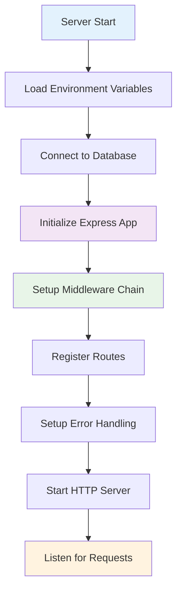
```mermaid
graph TD
    A[Server Start] --> B[Load Environment Variables]
    B --> C[Connect to Database]
    C --> D[Initialize Express App]
    D --> E[Setup Middleware Chain]
    E --> F[Register Routes]
    F --> G[Setup Error Handling]
    G --> H[Start HTTP Server]
    H --> I[Listen for Requests]
    
    style A fill:#e3f2fd
    style D fill:#f3e5f5
    style E fill:#e8f5e8
    style I fill:#fff3e0
```

## Server Initialization Flow

### 1. Application Bootstrap Process

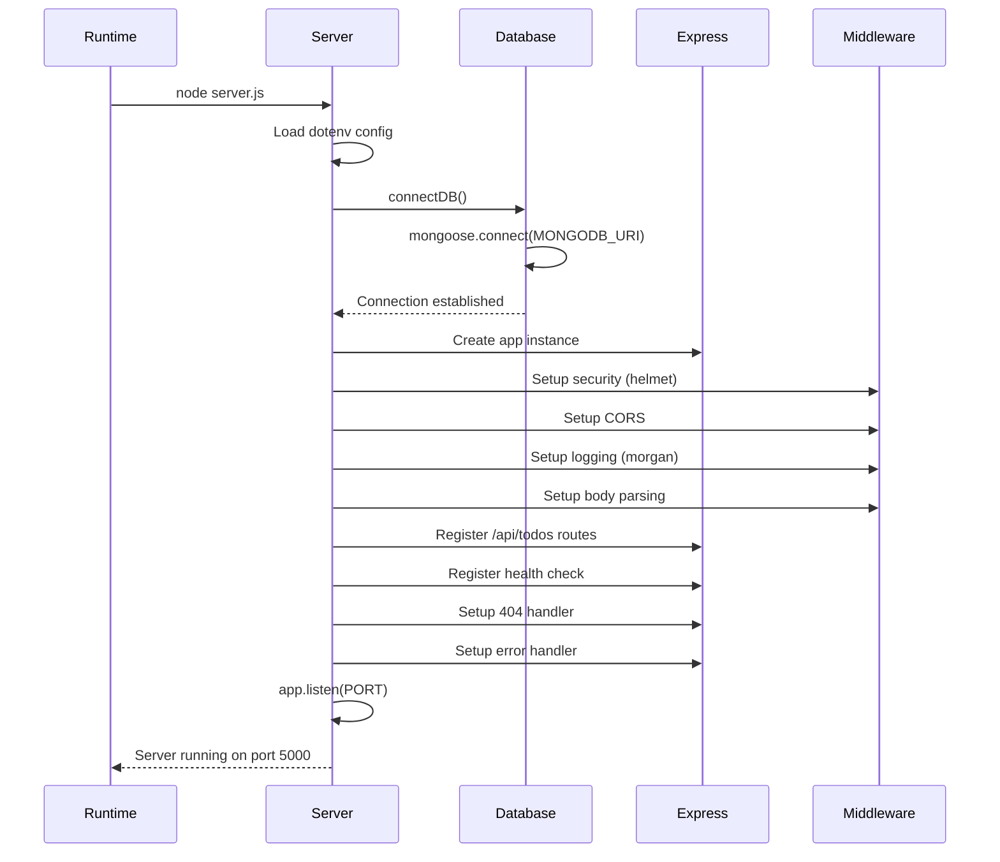
```mermaid
sequenceDiagram
    participant Runtime
    participant Server
    participant Database
    participant Express
    participant Middleware

    Runtime->>Server: node server.js
    Server->>Server: Load dotenv config
    Server->>Database: connectDB()
    
    Database->>Database: mongoose.connect(MONGODB_URI)
    Database-->>Server: Connection established
    
    Server->>Express: Create app instance
    Server->>Middleware: Setup security (helmet)
    Server->>Middleware: Setup CORS
    Server->>Middleware: Setup logging (morgan)
    Server->>Middleware: Setup body parsing
    
    Server->>Express: Register /api/todos routes
    Server->>Express: Register health check
    Server->>Express: Setup 404 handler
    Server->>Express: Setup error handler
    
    Server->>Server: app.listen(PORT)
    Server-->>Runtime: Server running on port 5000
```

## Middleware Chain Flow

### 2. Request Processing Pipeline

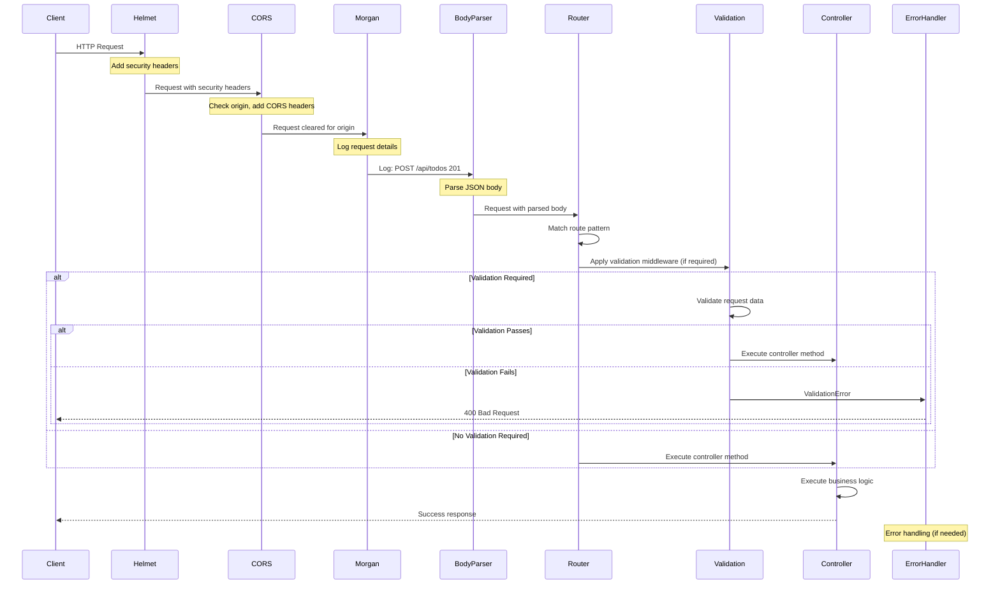
```mermaid
sequenceDiagram
    participant Client
    participant Helmet
    participant CORS
    participant Morgan
    participant BodyParser
    participant Router
    participant Validation
    participant Controller
    participant ErrorHandler

    Client->>Helmet: HTTP Request
    Note over Helmet: Add security headers
    Helmet->>CORS: Request with security headers
    
    Note over CORS: Check origin, add CORS headers
    CORS->>Morgan: Request cleared for origin
    
    Note over Morgan: Log request details
    Morgan->>BodyParser: Log: POST /api/todos 201
    
    Note over BodyParser: Parse JSON body
    BodyParser->>Router: Request with parsed body
    
    Router->>Router: Match route pattern
    Router->>Validation: Apply validation middleware (if required)
    
    alt Validation Required
        Validation->>Validation: Validate request data
        alt Validation Passes
            Validation->>Controller: Execute controller method
        else Validation Fails
            Validation->>ErrorHandler: ValidationError
            ErrorHandler-->>Client: 400 Bad Request
        end
    else No Validation Required
        Router->>Controller: Execute controller method
    end
    
    Controller->>Controller: Execute business logic
    Controller-->>Client: Success response
    
    Note over ErrorHandler: Error handling (if needed)
```

## API Endpoint Flows

### 3. GET /api/todos - Retrieve All Todos

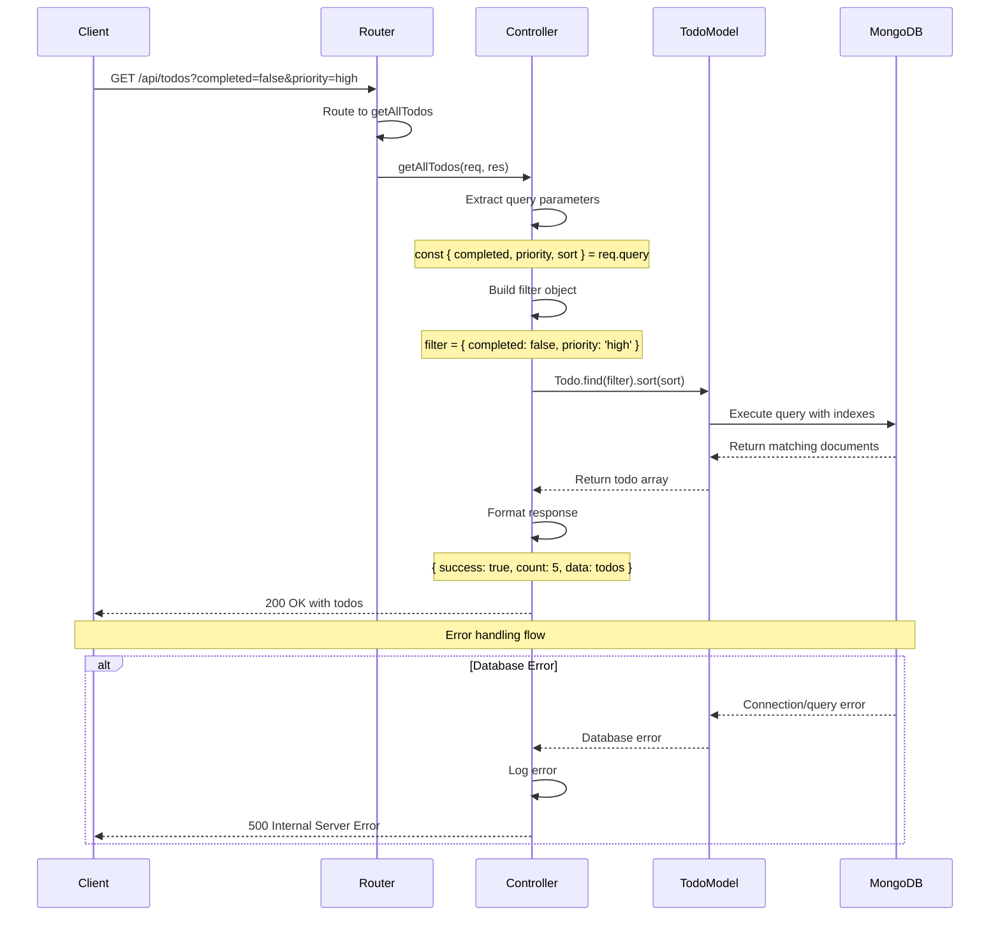
```mermaid
sequenceDiagram
    participant Client
    participant Router
    participant Controller
    participant TodoModel
    participant MongoDB

    Client->>Router: GET /api/todos?completed=false&priority=high
    Router->>Router: Route to getAllTodos
    Router->>Controller: getAllTodos(req, res)
    
    Controller->>Controller: Extract query parameters
    Note over Controller: const { completed, priority, sort } = req.query
    
    Controller->>Controller: Build filter object
    Note over Controller: filter = { completed: false, priority: 'high' }
    
    Controller->>TodoModel: Todo.find(filter).sort(sort)
    TodoModel->>MongoDB: Execute query with indexes
    MongoDB-->>TodoModel: Return matching documents
    TodoModel-->>Controller: Return todo array
    
    Controller->>Controller: Format response
    Note over Controller: { success: true, count: 5, data: todos }
    
    Controller-->>Client: 200 OK with todos
    
    Note over Client,MongoDB: Error handling flow
    alt Database Error
        MongoDB-->>TodoModel: Connection/query error
        TodoModel-->>Controller: Database error
        Controller->>Controller: Log error
        Controller-->>Client: 500 Internal Server Error
    end
```

### 4. POST /api/todos - Create New Todo

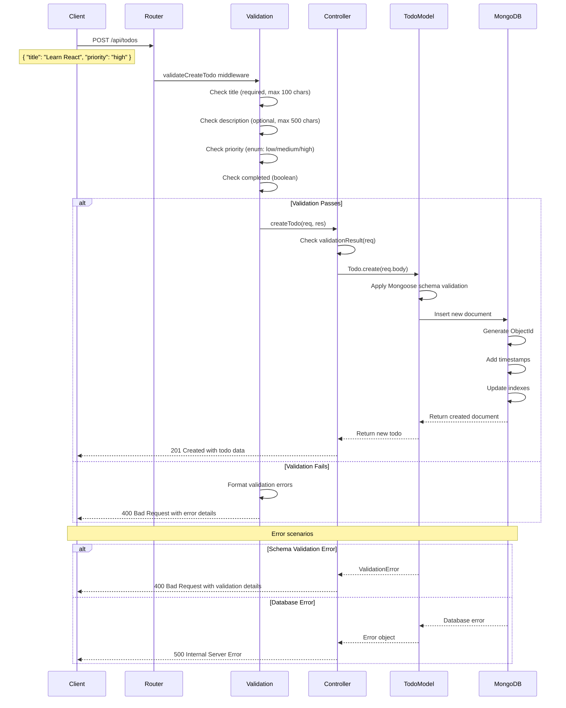
```mermaid
sequenceDiagram
    participant Client
    participant Router
    participant Validation
    participant Controller
    participant TodoModel
    participant MongoDB

    Client->>Router: POST /api/todos
    Note over Client: { "title": "Learn React", "priority": "high" }
    
    Router->>Validation: validateCreateTodo middleware
    
    Validation->>Validation: Check title (required, max 100 chars)
    Validation->>Validation: Check description (optional, max 500 chars)
    Validation->>Validation: Check priority (enum: low/medium/high)
    Validation->>Validation: Check completed (boolean)
    
    alt Validation Passes
        Validation->>Controller: createTodo(req, res)
        Controller->>Controller: Check validationResult(req)
        
        Controller->>TodoModel: Todo.create(req.body)
        TodoModel->>TodoModel: Apply Mongoose schema validation
        TodoModel->>MongoDB: Insert new document
        
        MongoDB->>MongoDB: Generate ObjectId
        MongoDB->>MongoDB: Add timestamps
        MongoDB->>MongoDB: Update indexes
        MongoDB-->>TodoModel: Return created document
        
        TodoModel-->>Controller: Return new todo
        Controller-->>Client: 201 Created with todo data
        
    else Validation Fails
        Validation->>Validation: Format validation errors
        Validation-->>Client: 400 Bad Request with error details
    end
    
    Note over Client,MongoDB: Error scenarios
    alt Schema Validation Error
        TodoModel-->>Controller: ValidationError
        Controller-->>Client: 400 Bad Request with validation details
    else Database Error
        MongoDB-->>TodoModel: Database error
        TodoModel-->>Controller: Error object
        Controller-->>Client: 500 Internal Server Error
    end
```

### 5. PUT /api/todos/:id - Update Todo

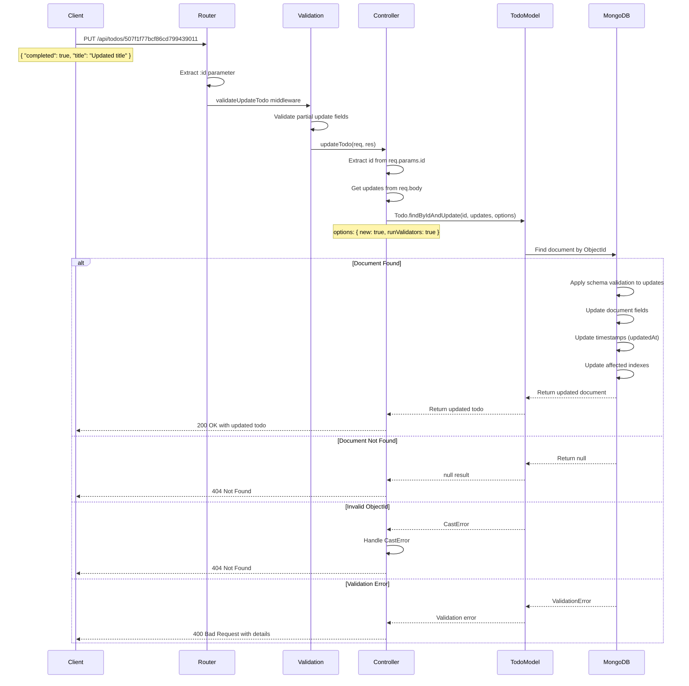
```mermaid
sequenceDiagram
    participant Client
    participant Router
    participant Validation
    participant Controller
    participant TodoModel
    participant MongoDB

    Client->>Router: PUT /api/todos/507f1f77bcf86cd799439011
    Note over Client: { "completed": true, "title": "Updated title" }
    
    Router->>Router: Extract :id parameter
    Router->>Validation: validateUpdateTodo middleware
    
    Validation->>Validation: Validate partial update fields
    Validation->>Controller: updateTodo(req, res)
    
    Controller->>Controller: Extract id from req.params.id
    Controller->>Controller: Get updates from req.body
    
    Controller->>TodoModel: Todo.findByIdAndUpdate(id, updates, options)
    Note over Controller: options: { new: true, runValidators: true }
    
    TodoModel->>MongoDB: Find document by ObjectId
    
    alt Document Found
        MongoDB->>MongoDB: Apply schema validation to updates
        MongoDB->>MongoDB: Update document fields
        MongoDB->>MongoDB: Update timestamps (updatedAt)
        MongoDB->>MongoDB: Update affected indexes
        MongoDB-->>TodoModel: Return updated document
        
        TodoModel-->>Controller: Return updated todo
        Controller-->>Client: 200 OK with updated todo
        
    else Document Not Found
        MongoDB-->>TodoModel: Return null
        TodoModel-->>Controller: null result
        Controller-->>Client: 404 Not Found
        
    else Invalid ObjectId
        TodoModel-->>Controller: CastError
        Controller->>Controller: Handle CastError
        Controller-->>Client: 404 Not Found
        
    else Validation Error
        MongoDB-->>TodoModel: ValidationError
        TodoModel-->>Controller: Validation error
        Controller-->>Client: 400 Bad Request with details
    end
```

### 6. DELETE /api/todos/:id - Delete Todo

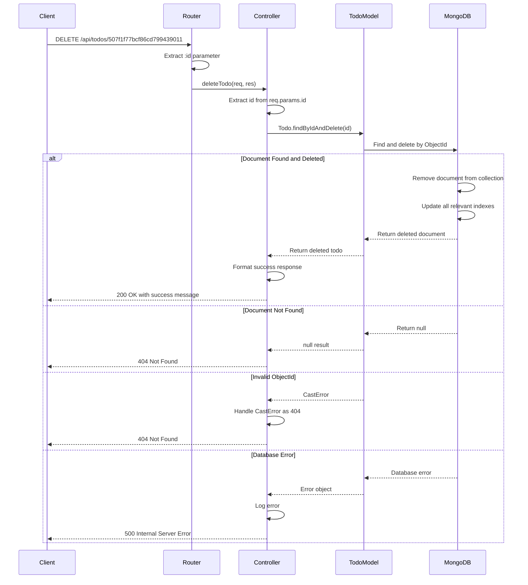
```mermaid
sequenceDiagram
    participant Client
    participant Router
    participant Controller
    participant TodoModel
    participant MongoDB

    Client->>Router: DELETE /api/todos/507f1f77bcf86cd799439011
    Router->>Router: Extract :id parameter
    Router->>Controller: deleteTodo(req, res)
    
    Controller->>Controller: Extract id from req.params.id
    Controller->>TodoModel: Todo.findByIdAndDelete(id)
    
    TodoModel->>MongoDB: Find and delete by ObjectId
    
    alt Document Found and Deleted
        MongoDB->>MongoDB: Remove document from collection
        MongoDB->>MongoDB: Update all relevant indexes
        MongoDB-->>TodoModel: Return deleted document
        
        TodoModel-->>Controller: Return deleted todo
        Controller->>Controller: Format success response
        Controller-->>Client: 200 OK with success message
        
    else Document Not Found
        MongoDB-->>TodoModel: Return null
        TodoModel-->>Controller: null result
        Controller-->>Client: 404 Not Found
        
    else Invalid ObjectId
        TodoModel-->>Controller: CastError
        Controller->>Controller: Handle CastError as 404
        Controller-->>Client: 404 Not Found
        
    else Database Error
        MongoDB-->>TodoModel: Database error
        TodoModel-->>Controller: Error object
        Controller->>Controller: Log error
        Controller-->>Client: 500 Internal Server Error
    end
```

## Advanced API Features

### 7. GET /api/todos/stats - Statistics Aggregation

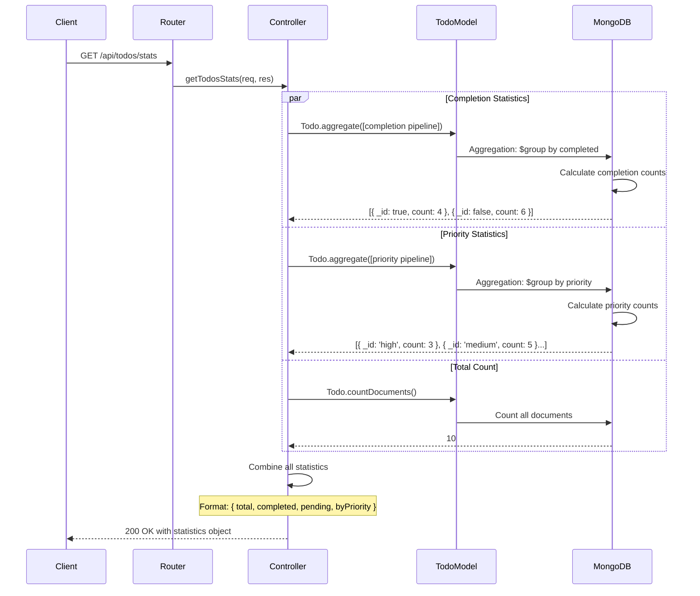
```mermaid
sequenceDiagram
    participant Client
    participant Router
    participant Controller
    participant TodoModel
    participant MongoDB

    Client->>Router: GET /api/todos/stats
    Router->>Controller: getTodosStats(req, res)
    
    par Completion Statistics
        Controller->>TodoModel: Todo.aggregate([completion pipeline])
        TodoModel->>MongoDB: Aggregation: $group by completed
        MongoDB->>MongoDB: Calculate completion counts
        MongoDB-->>Controller: [{ _id: true, count: 4 }, { _id: false, count: 6 }]
        
    and Priority Statistics
        Controller->>TodoModel: Todo.aggregate([priority pipeline])
        TodoModel->>MongoDB: Aggregation: $group by priority
        MongoDB->>MongoDB: Calculate priority counts
        MongoDB-->>Controller: [{ _id: 'high', count: 3 }, { _id: 'medium', count: 5 }...]
        
    and Total Count
        Controller->>TodoModel: Todo.countDocuments()
        TodoModel->>MongoDB: Count all documents
        MongoDB-->>Controller: 10
    end
    
    Controller->>Controller: Combine all statistics
    Note over Controller: Format: { total, completed, pending, byPriority }
    Controller-->>Client: 200 OK with statistics object
```

## Error Handling Flows

### 8. Centralized Error Handling

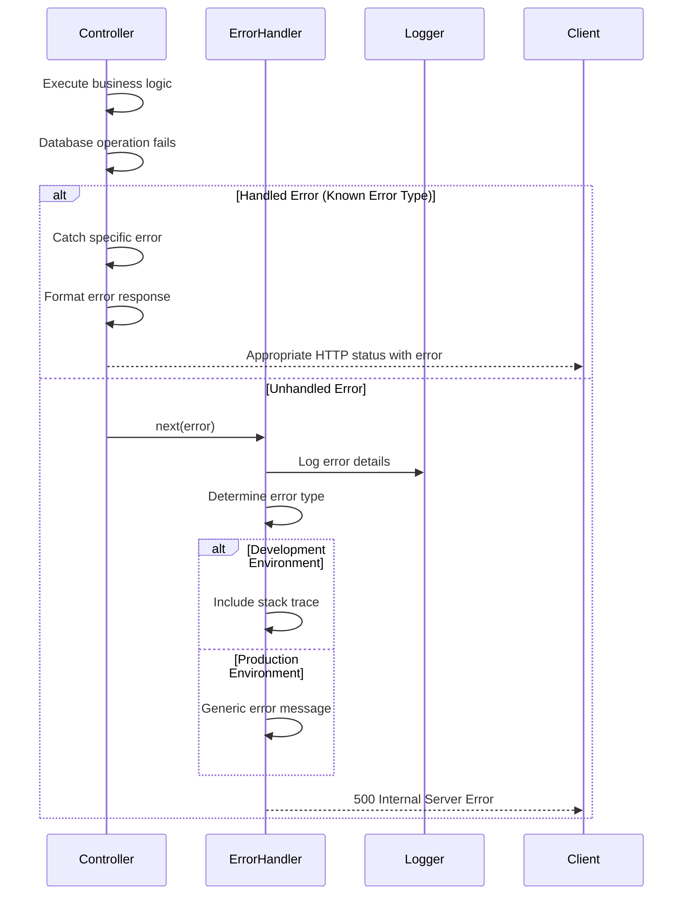
```mermaid
sequenceDiagram
    participant Controller
    participant ErrorHandler
    participant Logger
    participant Client

    Controller->>Controller: Execute business logic
    Controller->>Controller: Database operation fails
    
    alt Handled Error (Known Error Type)
        Controller->>Controller: Catch specific error
        Controller->>Controller: Format error response
        Controller-->>Client: Appropriate HTTP status with error
        
    else Unhandled Error
        Controller->>ErrorHandler: next(error)
        ErrorHandler->>Logger: Log error details
        ErrorHandler->>ErrorHandler: Determine error type
        
        alt Development Environment
            ErrorHandler->>ErrorHandler: Include stack trace
        else Production Environment
            ErrorHandler->>ErrorHandler: Generic error message
        end
        
        ErrorHandler-->>Client: 500 Internal Server Error
    end
```

### 9. Validation Error Flow

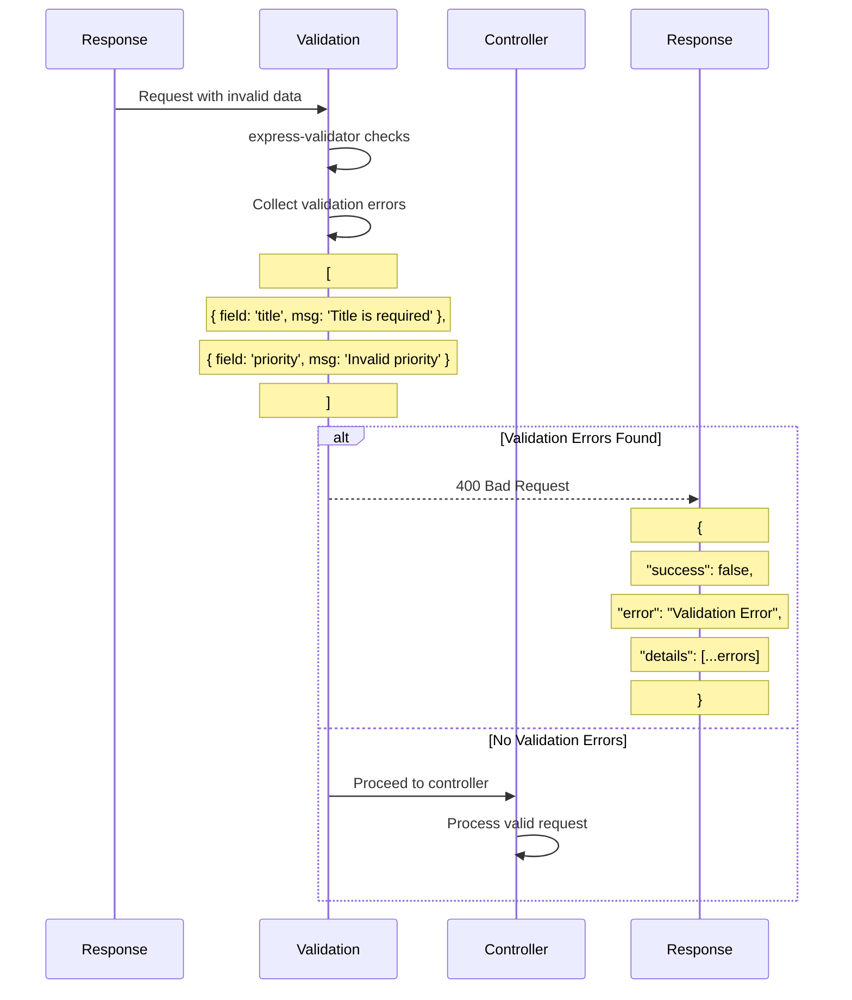
```mermaid
sequenceDiagram
    participant Client
    participant Validation
    participant Controller
    participant Client as Response

    Client->>Validation: Request with invalid data
    Validation->>Validation: express-validator checks
    
    Validation->>Validation: Collect validation errors
    Note over Validation: [
    Note over Validation:   { field: 'title', msg: 'Title is required' },
    Note over Validation:   { field: 'priority', msg: 'Invalid priority' }
    Note over Validation: ]
    
    alt Validation Errors Found
        Validation-->>Response: 400 Bad Request
        Note over Response: {
        Note over Response:   "success": false,
        Note over Response:   "error": "Validation Error",
        Note over Response:   "details": [...errors]
        Note over Response: }
    else No Validation Errors
        Validation->>Controller: Proceed to controller
        Controller->>Controller: Process valid request
    end
```

## Database Integration Patterns

### 10. Mongoose ODM Integration Flow

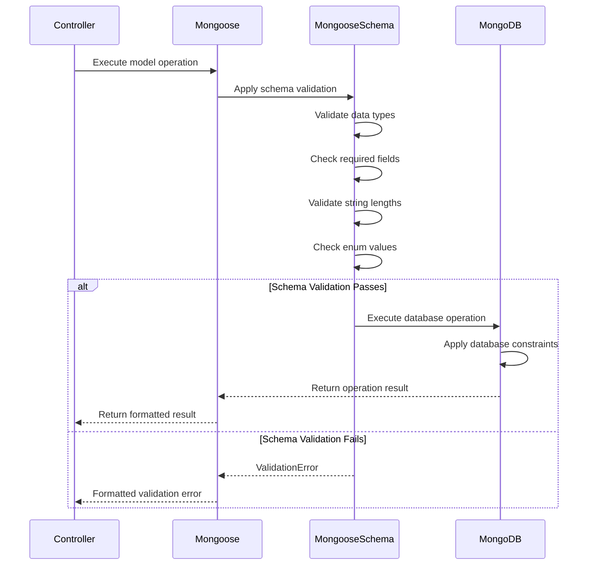
```mermaid
sequenceDiagram
    participant Controller
    participant Mongoose
    participant MongooseSchema
    participant MongoDB

    Controller->>Mongoose: Execute model operation
    Mongoose->>MongooseSchema: Apply schema validation
    
    MongooseSchema->>MongooseSchema: Validate data types
    MongooseSchema->>MongooseSchema: Check required fields
    MongooseSchema->>MongooseSchema: Validate string lengths
    MongooseSchema->>MongooseSchema: Check enum values
    
    alt Schema Validation Passes
        MongooseSchema->>MongoDB: Execute database operation
        MongoDB->>MongoDB: Apply database constraints
        MongoDB-->>Mongoose: Return operation result
        Mongoose-->>Controller: Return formatted result
        
    else Schema Validation Fails
        MongooseSchema-->>Mongoose: ValidationError
        Mongoose-->>Controller: Formatted validation error
    end
```

## Performance Optimization Flows

### 11. Query Optimization Pattern

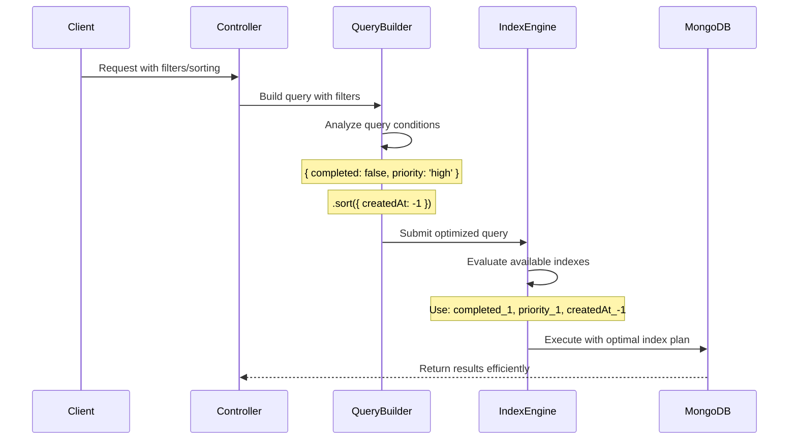
```mermaid
sequenceDiagram
    participant Client
    participant Controller
    participant QueryBuilder
    participant IndexEngine
    participant MongoDB

    Client->>Controller: Request with filters/sorting
    Controller->>QueryBuilder: Build query with filters
    
    QueryBuilder->>QueryBuilder: Analyze query conditions
    Note over QueryBuilder: { completed: false, priority: 'high' }
    Note over QueryBuilder: .sort({ createdAt: -1 })
    
    QueryBuilder->>IndexEngine: Submit optimized query
    IndexEngine->>IndexEngine: Evaluate available indexes
    Note over IndexEngine: Use: completed_1, priority_1, createdAt_-1
    
    IndexEngine->>MongoDB: Execute with optimal index plan
    MongoDB-->>Controller: Return results efficiently
```

### 12. Caching Strategy Flow

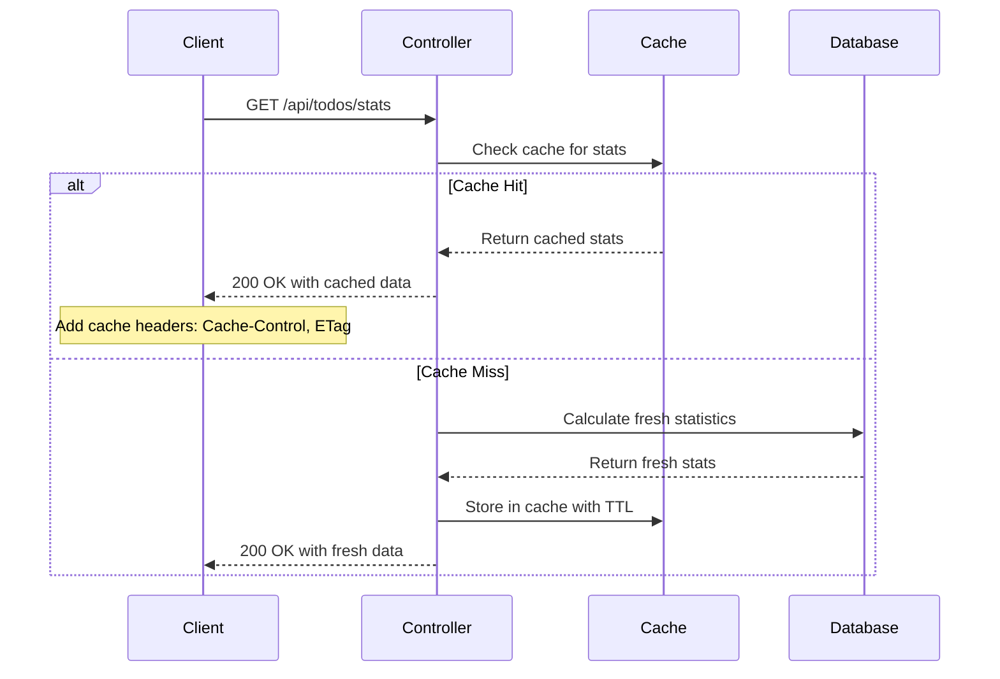
```mermaid
sequenceDiagram
    participant Client
    participant Controller
    participant Cache
    participant Database

    Client->>Controller: GET /api/todos/stats
    Controller->>Cache: Check cache for stats
    
    alt Cache Hit
        Cache-->>Controller: Return cached stats
        Controller-->>Client: 200 OK with cached data
        Note over Client: Add cache headers: Cache-Control, ETag
        
    else Cache Miss
        Controller->>Database: Calculate fresh statistics
        Database-->>Controller: Return fresh stats
        Controller->>Cache: Store in cache with TTL
        Controller-->>Client: 200 OK with fresh data
    end
```

## Security Implementation Flows

### 13. Security Middleware Chain

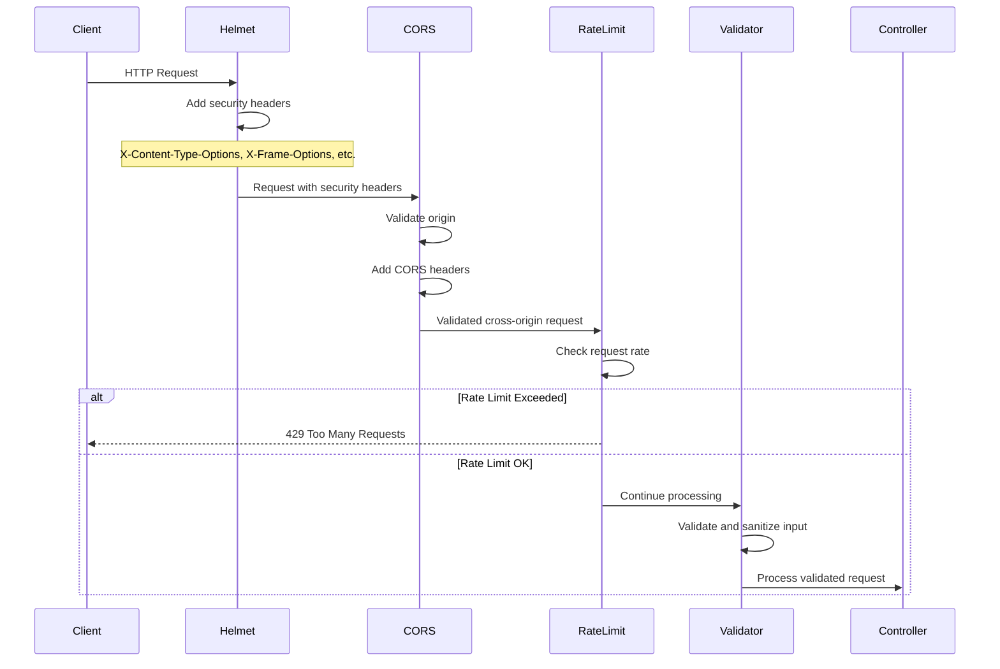
```mermaid
sequenceDiagram
    participant Client
    participant Helmet
    participant CORS
    participant RateLimit
    participant Validator
    participant Controller

    Client->>Helmet: HTTP Request
    Helmet->>Helmet: Add security headers
    Note over Helmet: X-Content-Type-Options, X-Frame-Options, etc.
    
    Helmet->>CORS: Request with security headers
    CORS->>CORS: Validate origin
    CORS->>CORS: Add CORS headers
    
    CORS->>RateLimit: Validated cross-origin request
    RateLimit->>RateLimit: Check request rate
    
    alt Rate Limit Exceeded
        RateLimit-->>Client: 429 Too Many Requests
    else Rate Limit OK
        RateLimit->>Validator: Continue processing
        Validator->>Validator: Validate and sanitize input
        Validator->>Controller: Process validated request
    end
```

## Environment-Based Configuration

### 14. Environment Configuration Flow

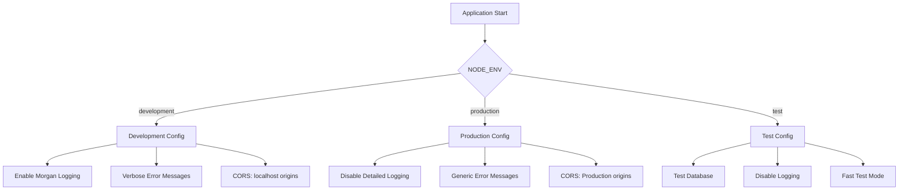
```mermaid
graph TD
    A[Application Start] --> B{NODE_ENV}
    
    B -->|development| C[Development Config]
    B -->|production| D[Production Config]
    B -->|test| E[Test Config]
    
    C --> F[Enable Morgan Logging]
    C --> G[Verbose Error Messages]
    C --> H[CORS: localhost origins]
    
    D --> I[Disable Detailed Logging]
    D --> J[Generic Error Messages]
    D --> K[CORS: Production origins]
    
    E --> L[Test Database]
    E --> M[Disable Logging]
    E --> N[Fast Test Mode]
```

## Key Express.js Patterns Used

### 1. **Middleware Pattern**
- Modular request processing pipeline
- Reusable middleware functions
- Error handling middleware

### 2. **Router Pattern**
- Organized route grouping
- RESTful endpoint design
- Parameter handling

### 3. **Controller Pattern**
- Separation of route logic and business logic
- Consistent error handling
- Async/await pattern

### 4. **Service Layer Pattern**
- Database operations abstraction
- Reusable business logic
- Mongoose ODM integration

### 5. **Configuration Pattern**
- Environment-based settings
- Centralized configuration management
- Secure credential handling

This Express.js application flow demonstrates modern Node.js backend patterns with proper middleware organization, error handling, security measures, and database integration through Mongoose ODM.