# MongoDB Application Flow - Todo Database

## Overview
This document details the complete database flow for the MongoDB layer of the Todo application, covering database initialization, CRUD operations, indexing strategies, and data management patterns.

## Database Architecture Flow

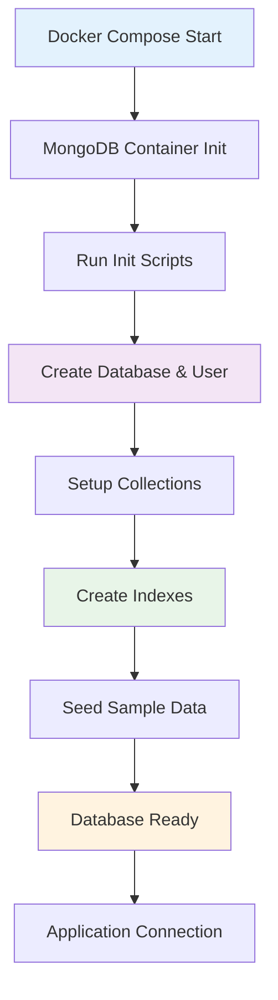
```mermaid
graph TD
    A[Docker Compose Start] --> B[MongoDB Container Init]
    B --> C[Run Init Scripts]
    C --> D[Create Database & User]
    D --> E[Setup Collections]
    E --> F[Create Indexes]
    F --> G[Seed Sample Data]
    G --> H[Database Ready]
    H --> I[Application Connection]
    
    style A fill:#e3f2fd
    style D fill:#f3e5f5
    style F fill:#e8f5e8
    style H fill:#fff3e0
```

## Database Initialization Flow

### 1. Docker Environment Setup

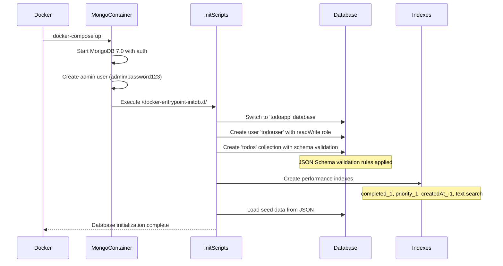
```mermaid
sequenceDiagram
    participant Docker
    participant MongoContainer
    participant InitScripts
    participant Database
    participant Indexes

    Docker->>MongoContainer: docker-compose up
    MongoContainer->>MongoContainer: Start MongoDB 7.0 with auth
    MongoContainer->>MongoContainer: Create admin user (admin/password123)
    
    MongoContainer->>InitScripts: Execute /docker-entrypoint-initdb.d/
    InitScripts->>Database: Switch to 'todoapp' database
    InitScripts->>Database: Create user 'todouser' with readWrite role
    
    InitScripts->>Database: Create 'todos' collection with schema validation
    Note over Database: JSON Schema validation rules applied
    
    InitScripts->>Indexes: Create performance indexes
    Note over Indexes: completed_1, priority_1, createdAt_-1, text search
    
    InitScripts->>Database: Load seed data from JSON
    InitScripts-->>Docker: Database initialization complete
```

### 2. Application Connection Flow

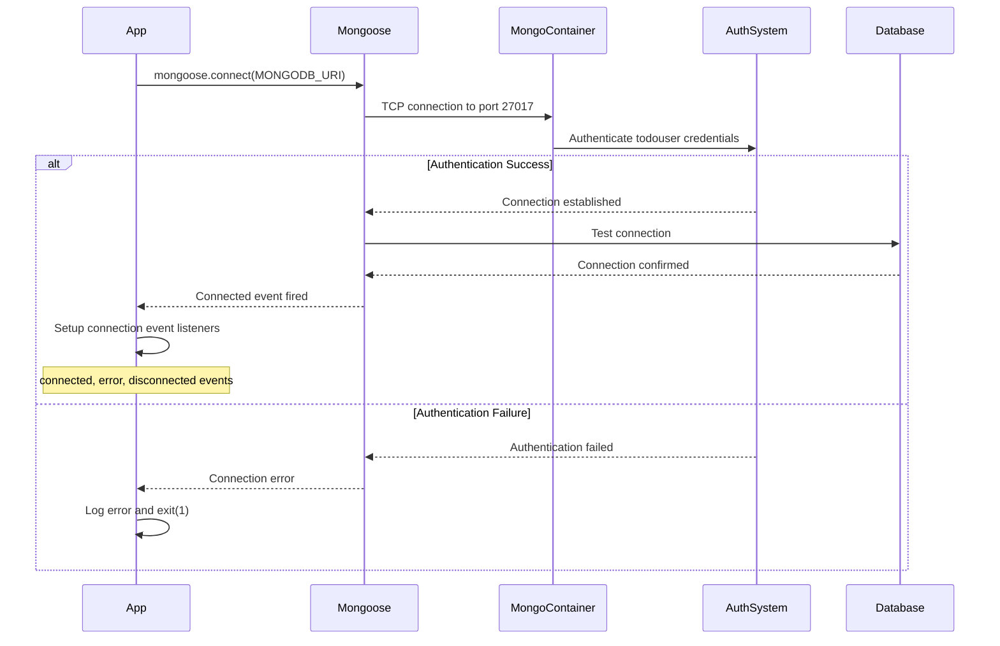
```mermaid
sequenceDiagram
    participant App
    participant Mongoose
    participant MongoContainer
    participant AuthSystem
    participant Database

    App->>Mongoose: mongoose.connect(MONGODB_URI)
    Mongoose->>MongoContainer: TCP connection to port 27017
    MongoContainer->>AuthSystem: Authenticate todouser credentials
    
    alt Authentication Success
        AuthSystem-->>Mongoose: Connection established
        Mongoose->>Database: Test connection
        Database-->>Mongoose: Connection confirmed
        Mongoose-->>App: Connected event fired
        
        App->>App: Setup connection event listeners
        Note over App: connected, error, disconnected events
        
    else Authentication Failure
        AuthSystem-->>Mongoose: Authentication failed
        Mongoose-->>App: Connection error
        App->>App: Log error and exit(1)
    end
```

## CRUD Operations Flow

### 3. Create Todo Document Flow

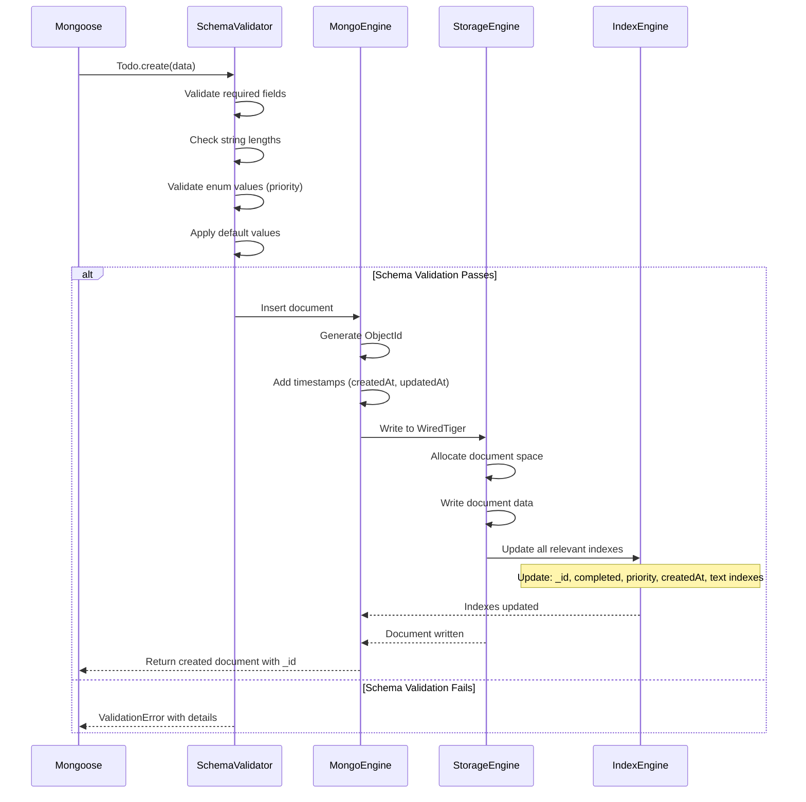
```mermaid
sequenceDiagram
    participant Mongoose
    participant SchemaValidator
    participant MongoEngine
    participant StorageEngine
    participant IndexEngine

    Mongoose->>SchemaValidator: Todo.create(data)
    SchemaValidator->>SchemaValidator: Validate required fields
    SchemaValidator->>SchemaValidator: Check string lengths
    SchemaValidator->>SchemaValidator: Validate enum values (priority)
    SchemaValidator->>SchemaValidator: Apply default values
    
    alt Schema Validation Passes
        SchemaValidator->>MongoEngine: Insert document
        MongoEngine->>MongoEngine: Generate ObjectId
        MongoEngine->>MongoEngine: Add timestamps (createdAt, updatedAt)
        
        MongoEngine->>StorageEngine: Write to WiredTiger
        StorageEngine->>StorageEngine: Allocate document space
        StorageEngine->>StorageEngine: Write document data
        
        StorageEngine->>IndexEngine: Update all relevant indexes
        Note over IndexEngine: Update: _id, completed, priority, createdAt, text indexes
        
        IndexEngine-->>MongoEngine: Indexes updated
        StorageEngine-->>MongoEngine: Document written
        MongoEngine-->>Mongoose: Return created document with _id
        
    else Schema Validation Fails
        SchemaValidator-->>Mongoose: ValidationError with details
    end
```

### 4. Query/Find Operations Flow

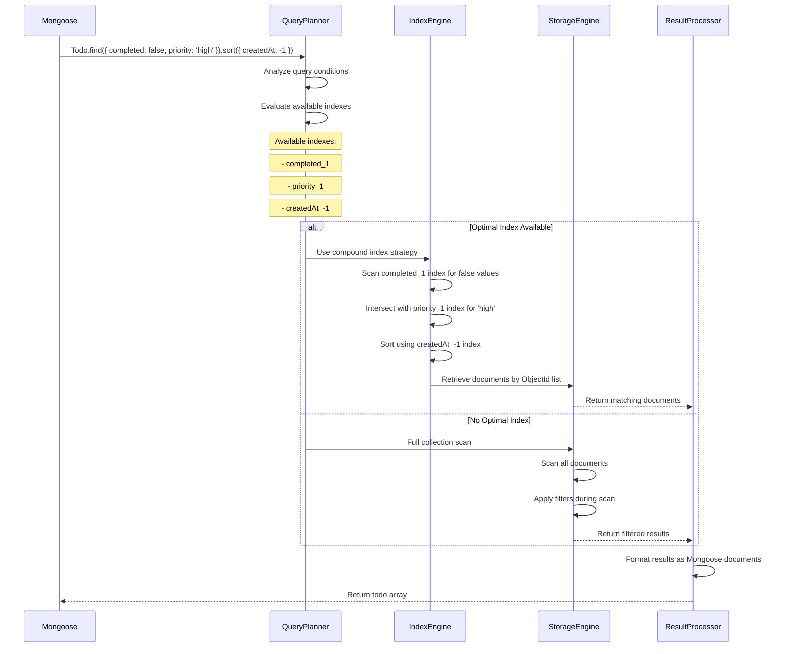
```mermaid
sequenceDiagram
    participant Mongoose
    participant QueryPlanner
    participant IndexEngine
    participant StorageEngine
    participant ResultProcessor

    Mongoose->>QueryPlanner: Todo.find({ completed: false, priority: 'high' }).sort({ createdAt: -1 })
    QueryPlanner->>QueryPlanner: Analyze query conditions
    QueryPlanner->>QueryPlanner: Evaluate available indexes
    
    Note over QueryPlanner: Available indexes:
    Note over QueryPlanner: - completed_1
    Note over QueryPlanner: - priority_1  
    Note over QueryPlanner: - createdAt_-1
    
    alt Optimal Index Available
        QueryPlanner->>IndexEngine: Use compound index strategy
        IndexEngine->>IndexEngine: Scan completed_1 index for false values
        IndexEngine->>IndexEngine: Intersect with priority_1 index for 'high'
        IndexEngine->>IndexEngine: Sort using createdAt_-1 index
        
        IndexEngine->>StorageEngine: Retrieve documents by ObjectId list
        StorageEngine-->>ResultProcessor: Return matching documents
        
    else No Optimal Index
        QueryPlanner->>StorageEngine: Full collection scan
        StorageEngine->>StorageEngine: Scan all documents
        StorageEngine->>StorageEngine: Apply filters during scan
        StorageEngine-->>ResultProcessor: Return filtered results
    end
    
    ResultProcessor->>ResultProcessor: Format results as Mongoose documents
    ResultProcessor-->>Mongoose: Return todo array
```

### 5. Update Document Flow

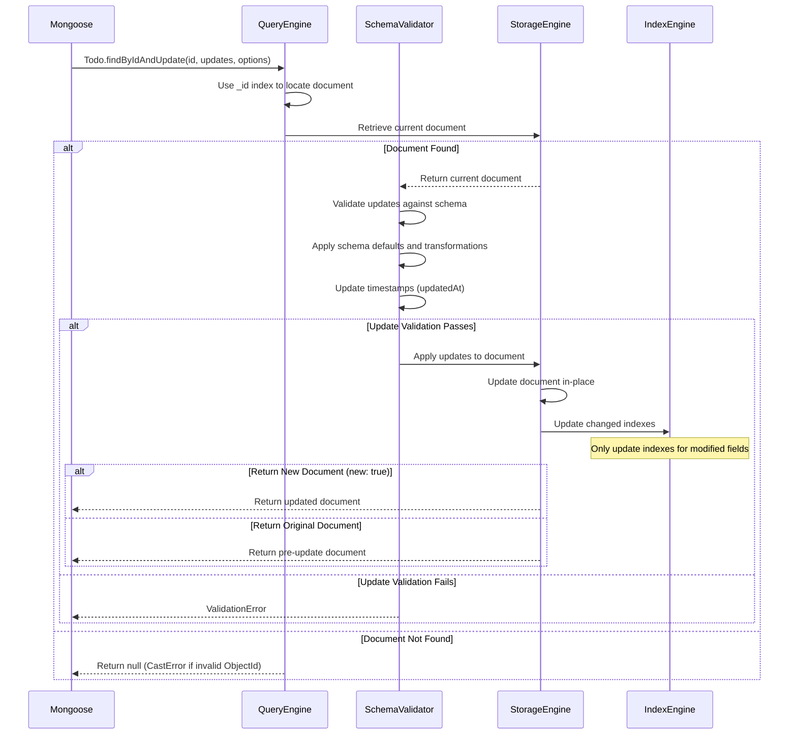
```mermaid
sequenceDiagram
    participant Mongoose
    participant QueryEngine
    participant SchemaValidator
    participant StorageEngine
    participant IndexEngine

    Mongoose->>QueryEngine: Todo.findByIdAndUpdate(id, updates, options)
    QueryEngine->>QueryEngine: Use _id index to locate document
    QueryEngine->>StorageEngine: Retrieve current document
    
    alt Document Found
        StorageEngine-->>SchemaValidator: Return current document
        SchemaValidator->>SchemaValidator: Validate updates against schema
        SchemaValidator->>SchemaValidator: Apply schema defaults and transformations
        SchemaValidator->>SchemaValidator: Update timestamps (updatedAt)
        
        alt Update Validation Passes
            SchemaValidator->>StorageEngine: Apply updates to document
            StorageEngine->>StorageEngine: Update document in-place
            
            StorageEngine->>IndexEngine: Update changed indexes
            Note over IndexEngine: Only update indexes for modified fields
            
            alt Return New Document (new: true)
                StorageEngine-->>Mongoose: Return updated document
            else Return Original Document  
                StorageEngine-->>Mongoose: Return pre-update document
            end
            
        else Update Validation Fails
            SchemaValidator-->>Mongoose: ValidationError
        end
        
    else Document Not Found
        QueryEngine-->>Mongoose: Return null (CastError if invalid ObjectId)
    end
```

### 6. Delete Document Flow

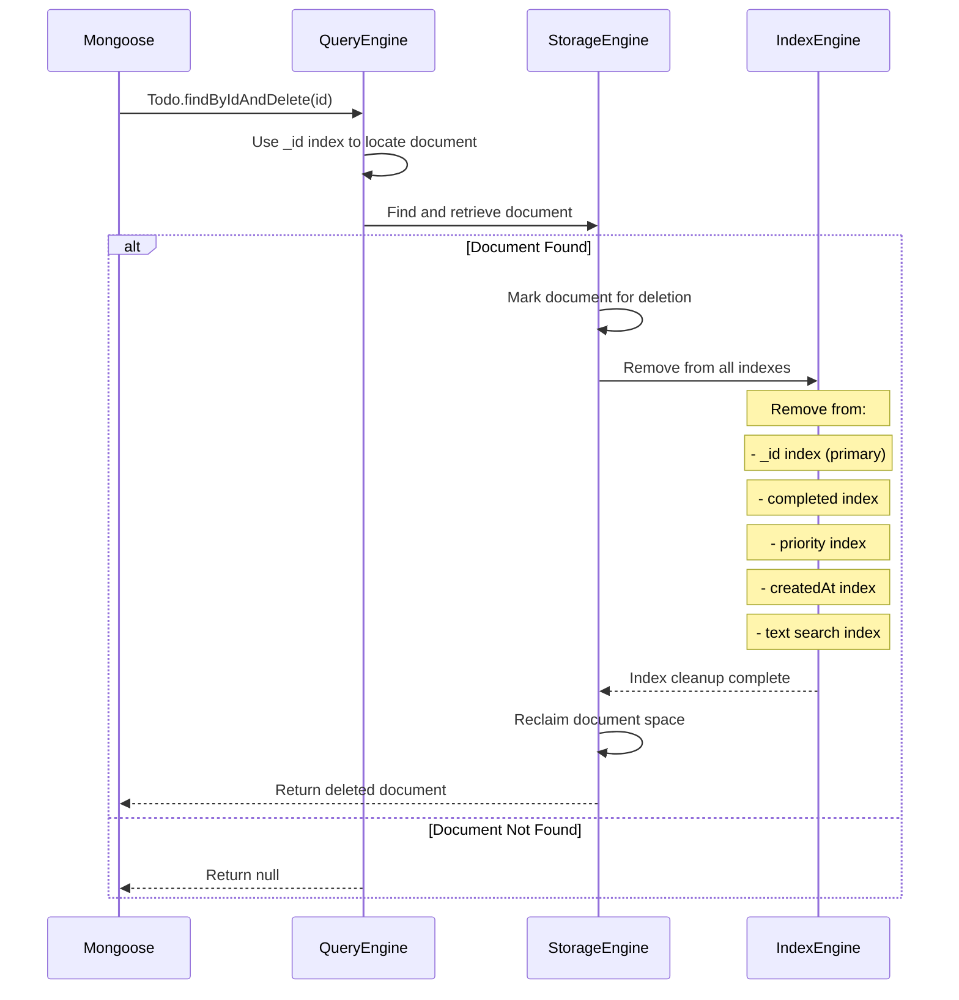
```mermaid
sequenceDiagram
    participant Mongoose
    participant QueryEngine
    participant StorageEngine
    participant IndexEngine

    Mongoose->>QueryEngine: Todo.findByIdAndDelete(id)
    QueryEngine->>QueryEngine: Use _id index to locate document
    QueryEngine->>StorageEngine: Find and retrieve document
    
    alt Document Found
        StorageEngine->>StorageEngine: Mark document for deletion
        StorageEngine->>IndexEngine: Remove from all indexes
        
        Note over IndexEngine: Remove from:
        Note over IndexEngine: - _id index (primary)
        Note over IndexEngine: - completed index
        Note over IndexEngine: - priority index
        Note over IndexEngine: - createdAt index
        Note over IndexEngine: - text search index
        
        IndexEngine-->>StorageEngine: Index cleanup complete
        StorageEngine->>StorageEngine: Reclaim document space
        StorageEngine-->>Mongoose: Return deleted document
        
    else Document Not Found
        QueryEngine-->>Mongoose: Return null
    end
```

## Advanced Database Operations

### 7. Aggregation Pipeline Flow

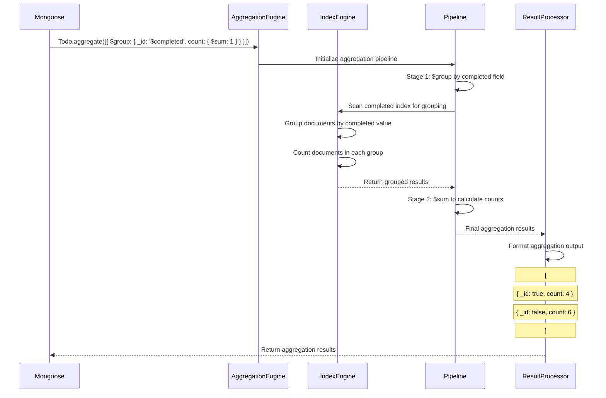
```mermaid
sequenceDiagram
    participant Mongoose
    participant AggregationEngine
    participant IndexEngine
    participant Pipeline
    participant ResultProcessor

    Mongoose->>AggregationEngine: Todo.aggregate([{ $group: { _id: '$completed', count: { $sum: 1 } } }])
    AggregationEngine->>Pipeline: Initialize aggregation pipeline
    
    Pipeline->>Pipeline: Stage 1: $group by completed field
    Pipeline->>IndexEngine: Scan completed index for grouping
    IndexEngine->>IndexEngine: Group documents by completed value
    IndexEngine->>IndexEngine: Count documents in each group
    
    IndexEngine-->>Pipeline: Return grouped results
    Pipeline->>Pipeline: Stage 2: $sum to calculate counts
    Pipeline-->>ResultProcessor: Final aggregation results
    
    ResultProcessor->>ResultProcessor: Format aggregation output
    Note over ResultProcessor: [
    Note over ResultProcessor:   { _id: true, count: 4 },
    Note over ResultProcessor:   { _id: false, count: 6 }
    Note over ResultProcessor: ]
    
    ResultProcessor-->>Mongoose: Return aggregation results
```

### 8. Text Search Flow

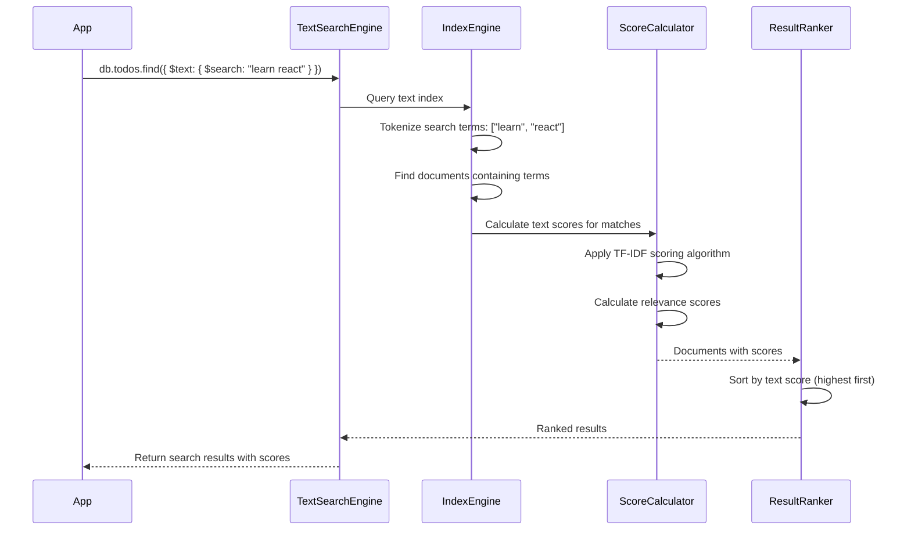
```mermaid
sequenceDiagram
    participant App
    participant TextSearchEngine
    participant IndexEngine
    participant ScoreCalculator
    participant ResultRanker

    App->>TextSearchEngine: db.todos.find({ $text: { $search: "learn react" } })
    TextSearchEngine->>IndexEngine: Query text index
    IndexEngine->>IndexEngine: Tokenize search terms: ["learn", "react"]
    IndexEngine->>IndexEngine: Find documents containing terms
    
    IndexEngine->>ScoreCalculator: Calculate text scores for matches
    ScoreCalculator->>ScoreCalculator: Apply TF-IDF scoring algorithm
    ScoreCalculator->>ScoreCalculator: Calculate relevance scores
    
    ScoreCalculator-->>ResultRanker: Documents with scores
    ResultRanker->>ResultRanker: Sort by text score (highest first)
    ResultRanker-->>TextSearchEngine: Ranked results
    
    TextSearchEngine-->>App: Return search results with scores
```

## Index Management Flow

### 9. Index Creation and Maintenance

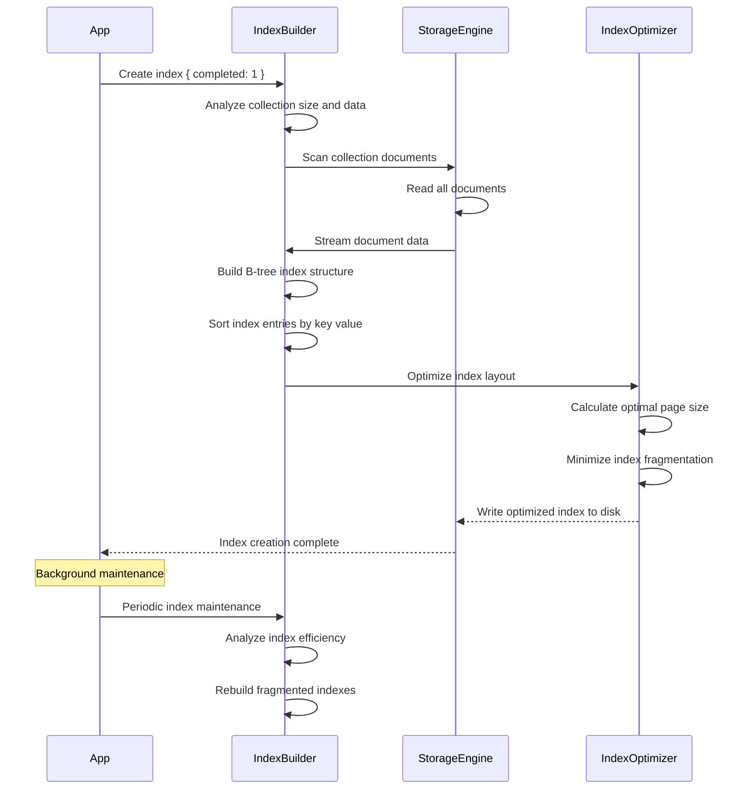
```mermaid
sequenceDiagram
    participant App
    participant IndexBuilder
    participant StorageEngine
    participant IndexOptimizer

    App->>IndexBuilder: Create index { completed: 1 }
    IndexBuilder->>IndexBuilder: Analyze collection size and data
    IndexBuilder->>StorageEngine: Scan collection documents
    
    StorageEngine->>StorageEngine: Read all documents
    StorageEngine->>IndexBuilder: Stream document data
    
    IndexBuilder->>IndexBuilder: Build B-tree index structure
    IndexBuilder->>IndexBuilder: Sort index entries by key value
    IndexBuilder->>IndexOptimizer: Optimize index layout
    
    IndexOptimizer->>IndexOptimizer: Calculate optimal page size
    IndexOptimizer->>IndexOptimizer: Minimize index fragmentation
    IndexOptimizer-->>StorageEngine: Write optimized index to disk
    
    StorageEngine-->>App: Index creation complete
    
    Note over App: Background maintenance
    App->>IndexBuilder: Periodic index maintenance
    IndexBuilder->>IndexBuilder: Analyze index efficiency
    IndexBuilder->>IndexBuilder: Rebuild fragmented indexes
```

### 10. Query Optimization with Indexes

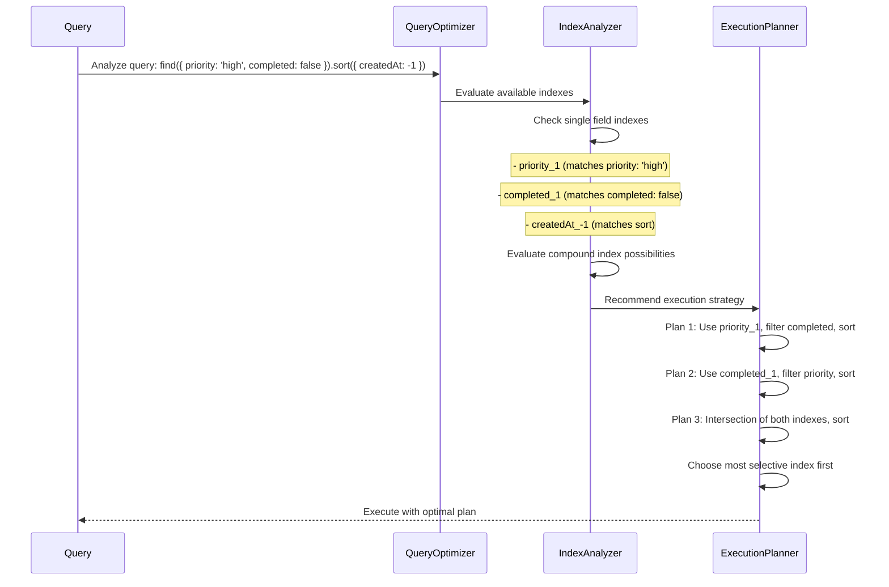
```mermaid
sequenceDiagram
    participant Query
    participant QueryOptimizer
    participant IndexAnalyzer
    participant ExecutionPlanner

    Query->>QueryOptimizer: Analyze query: find({ priority: 'high', completed: false }).sort({ createdAt: -1 })
    QueryOptimizer->>IndexAnalyzer: Evaluate available indexes
    
    IndexAnalyzer->>IndexAnalyzer: Check single field indexes
    Note over IndexAnalyzer: - priority_1 (matches priority: 'high')
    Note over IndexAnalyzer: - completed_1 (matches completed: false)
    Note over IndexAnalyzer: - createdAt_-1 (matches sort)
    
    IndexAnalyzer->>IndexAnalyzer: Evaluate compound index possibilities
    IndexAnalyzer->>ExecutionPlanner: Recommend execution strategy
    
    ExecutionPlanner->>ExecutionPlanner: Plan 1: Use priority_1, filter completed, sort
    ExecutionPlanner->>ExecutionPlanner: Plan 2: Use completed_1, filter priority, sort
    ExecutionPlanner->>ExecutionPlanner: Plan 3: Intersection of both indexes, sort
    
    ExecutionPlanner->>ExecutionPlanner: Choose most selective index first
    ExecutionPlanner-->>Query: Execute with optimal plan
```

## Data Validation and Integrity

### 11. Schema Validation Flow

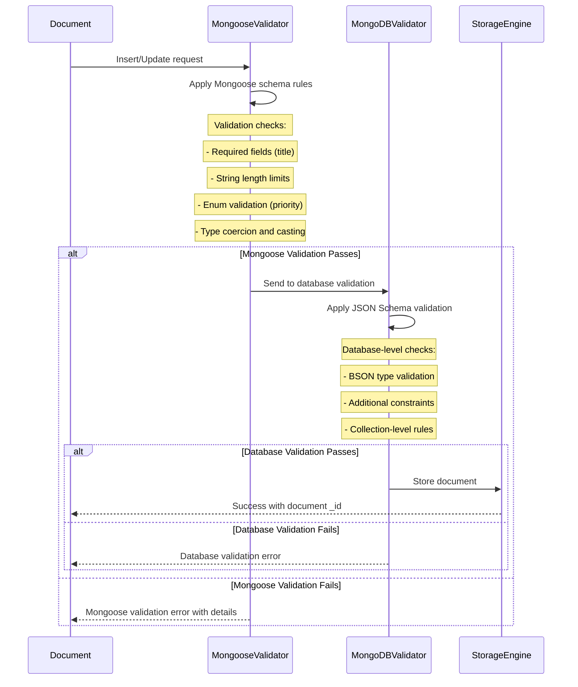
```mermaid
sequenceDiagram
    participant Document
    participant MongooseValidator
    participant MongoDBValidator
    participant StorageEngine

    Document->>MongooseValidator: Insert/Update request
    MongooseValidator->>MongooseValidator: Apply Mongoose schema rules
    
    Note over MongooseValidator: Validation checks:
    Note over MongooseValidator: - Required fields (title)
    Note over MongooseValidator: - String length limits
    Note over MongooseValidator: - Enum validation (priority)
    Note over MongooseValidator: - Type coercion and casting
    
    alt Mongoose Validation Passes
        MongooseValidator->>MongoDBValidator: Send to database validation
        MongoDBValidator->>MongoDBValidator: Apply JSON Schema validation
        
        Note over MongoDBValidator: Database-level checks:
        Note over MongoDBValidator: - BSON type validation
        Note over MongoDBValidator: - Additional constraints
        Note over MongoDBValidator: - Collection-level rules
        
        alt Database Validation Passes
            MongoDBValidator->>StorageEngine: Store document
            StorageEngine-->>Document: Success with document _id
        else Database Validation Fails
            MongoDBValidator-->>Document: Database validation error
        end
        
    else Mongoose Validation Fails
        MongooseValidator-->>Document: Mongoose validation error with details
    end
```

### 12. Transaction Handling (for Multi-Document Operations)

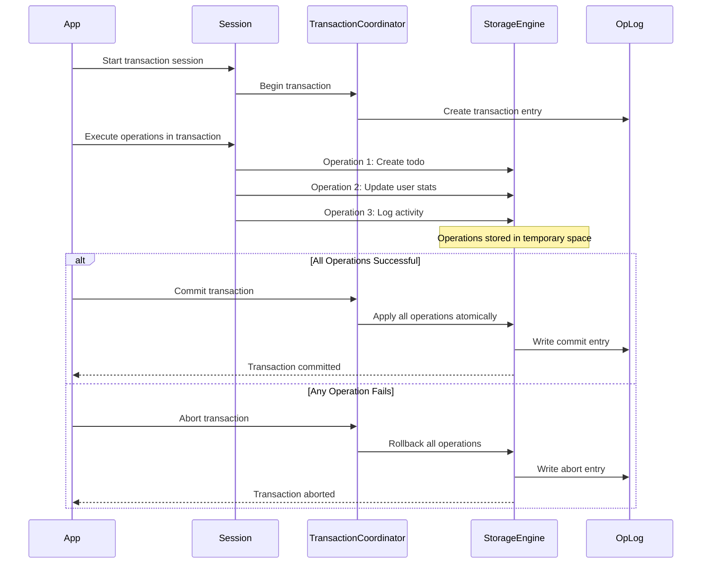
```mermaid
sequenceDiagram
    participant App
    participant Session
    participant TransactionCoordinator
    participant StorageEngine
    participant OpLog

    App->>Session: Start transaction session
    Session->>TransactionCoordinator: Begin transaction
    TransactionCoordinator->>OpLog: Create transaction entry
    
    App->>Session: Execute operations in transaction
    Session->>StorageEngine: Operation 1: Create todo
    Session->>StorageEngine: Operation 2: Update user stats
    Session->>StorageEngine: Operation 3: Log activity
    
    Note over StorageEngine: Operations stored in temporary space
    
    alt All Operations Successful
        App->>TransactionCoordinator: Commit transaction
        TransactionCoordinator->>StorageEngine: Apply all operations atomically
        StorageEngine->>OpLog: Write commit entry
        StorageEngine-->>App: Transaction committed
        
    else Any Operation Fails
        App->>TransactionCoordinator: Abort transaction
        TransactionCoordinator->>StorageEngine: Rollback all operations
        StorageEngine->>OpLog: Write abort entry
        StorageEngine-->>App: Transaction aborted
    end
```

## Performance and Optimization Flows

### 13. Connection Pool Management

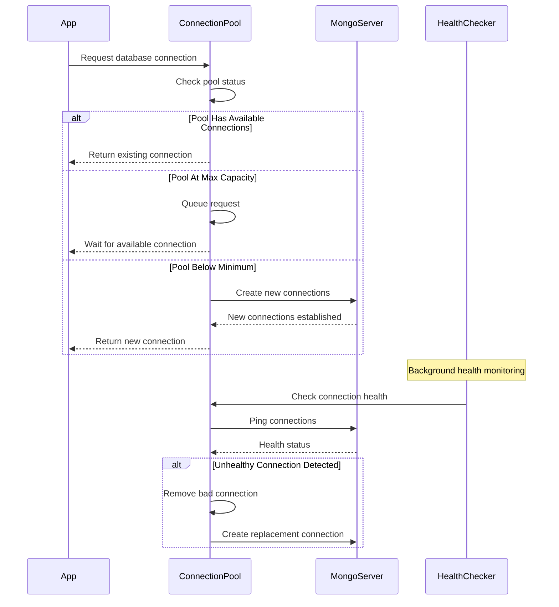
```mermaid
sequenceDiagram
    participant App
    participant ConnectionPool
    participant MongoServer
    participant HealthChecker

    App->>ConnectionPool: Request database connection
    ConnectionPool->>ConnectionPool: Check pool status
    
    alt Pool Has Available Connections
        ConnectionPool-->>App: Return existing connection
    else Pool At Max Capacity
        ConnectionPool->>ConnectionPool: Queue request
        ConnectionPool-->>App: Wait for available connection
    else Pool Below Minimum
        ConnectionPool->>MongoServer: Create new connections
        MongoServer-->>ConnectionPool: New connections established
        ConnectionPool-->>App: Return new connection
    end
    
    Note over HealthChecker: Background health monitoring
    HealthChecker->>ConnectionPool: Check connection health
    ConnectionPool->>MongoServer: Ping connections
    MongoServer-->>ConnectionPool: Health status
    
    alt Unhealthy Connection Detected
        ConnectionPool->>ConnectionPool: Remove bad connection
        ConnectionPool->>MongoServer: Create replacement connection
    end
```

### 14. Backup and Restore Flow

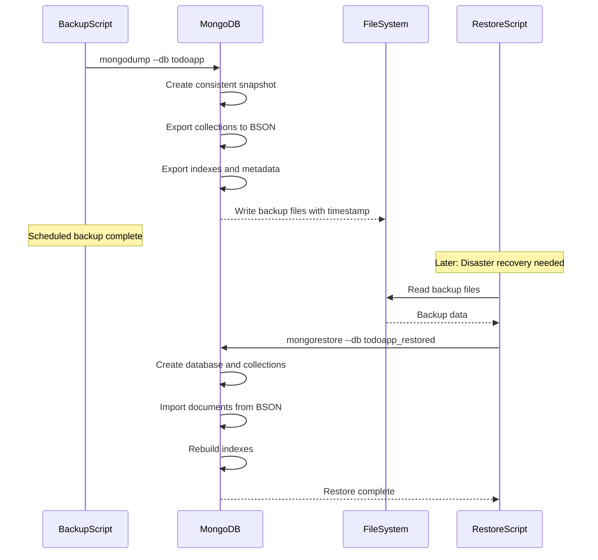
```mermaid
sequenceDiagram
    participant BackupScript
    participant MongoDB
    participant FileSystem
    participant RestoreScript

    BackupScript->>MongoDB: mongodump --db todoapp
    MongoDB->>MongoDB: Create consistent snapshot
    MongoDB->>MongoDB: Export collections to BSON
    MongoDB->>MongoDB: Export indexes and metadata
    MongoDB-->>FileSystem: Write backup files with timestamp
    
    Note over BackupScript: Scheduled backup complete
    
    Note over RestoreScript: Later: Disaster recovery needed
    
    RestoreScript->>FileSystem: Read backup files
    FileSystem-->>RestoreScript: Backup data
    RestoreScript->>MongoDB: mongorestore --db todoapp_restored
    MongoDB->>MongoDB: Create database and collections
    MongoDB->>MongoDB: Import documents from BSON
    MongoDB->>MongoDB: Rebuild indexes
    MongoDB-->>RestoreScript: Restore complete
```

## Monitoring and Analytics

### 15. Performance Monitoring Flow

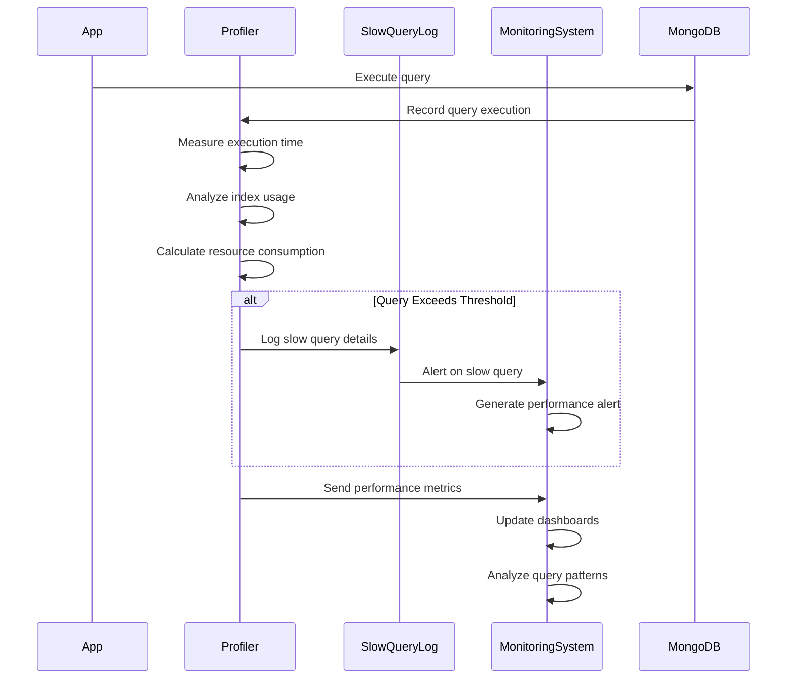
```mermaid
sequenceDiagram
    participant App
    participant Profiler
    participant SlowQueryLog
    participant MonitoringSystem

    App->>MongoDB: Execute query
    MongoDB->>Profiler: Record query execution
    Profiler->>Profiler: Measure execution time
    Profiler->>Profiler: Analyze index usage
    Profiler->>Profiler: Calculate resource consumption
    
    alt Query Exceeds Threshold
        Profiler->>SlowQueryLog: Log slow query details
        SlowQueryLog->>MonitoringSystem: Alert on slow query
        MonitoringSystem->>MonitoringSystem: Generate performance alert
    end
    
    Profiler->>MonitoringSystem: Send performance metrics
    MonitoringSystem->>MonitoringSystem: Update dashboards
    MonitoringSystem->>MonitoringSystem: Analyze query patterns
```

## Key MongoDB Patterns Used

### 1. **Document Design Pattern**
- Embedded documents for related data
- Proper field naming and structure
- Schema validation for data integrity

### 2. **Indexing Strategy Pattern**
- Single field indexes for common queries
- Compound indexes for complex queries
- Text indexes for search functionality
- TTL indexes for data expiration (if needed)

### 3. **Connection Management Pattern**
- Connection pooling for performance
- Automatic reconnection handling
- Graceful connection cleanup

### 4. **Error Handling Pattern**
- Mongoose validation errors
- Database connection errors
- Query execution errors
- Transaction rollback handling

### 5. **Performance Optimization Pattern**
- Query optimization with explain()
- Index usage monitoring
- Connection pool tuning
- Aggregation pipeline optimization

This MongoDB application flow demonstrates modern database patterns with proper indexing, validation, performance optimization, and operational management for a production-ready Todo application.