# React.js Application Flow - Todo App

## Overview
This document details the complete application flow for the React.js frontend of the Todo application, covering component lifecycle, state management, user interactions, and data flow patterns.

## Component Hierarchy and Flow

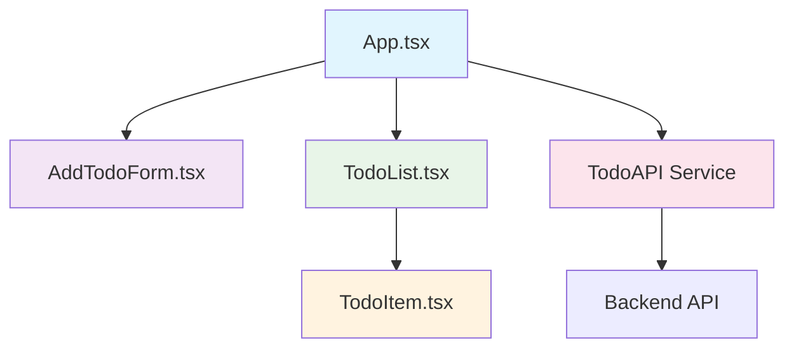

## Application Startup Flow

### 1. Initial Application Load

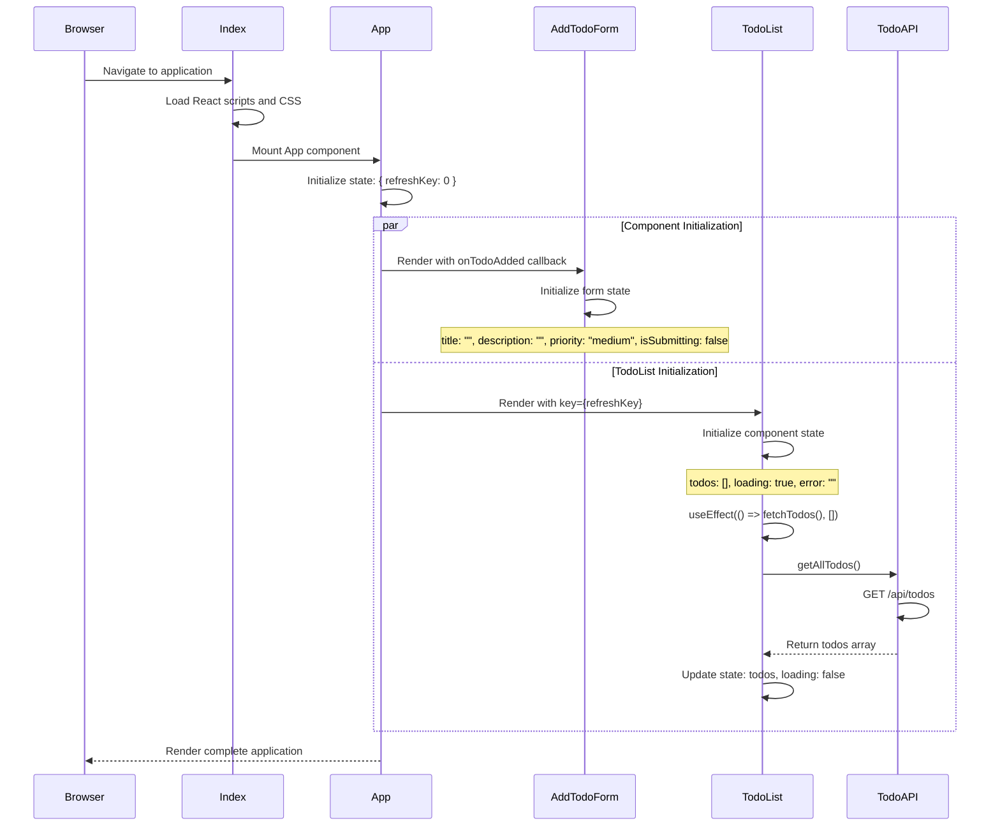

## Core User Flow Patterns

### 2. Create Todo Flow

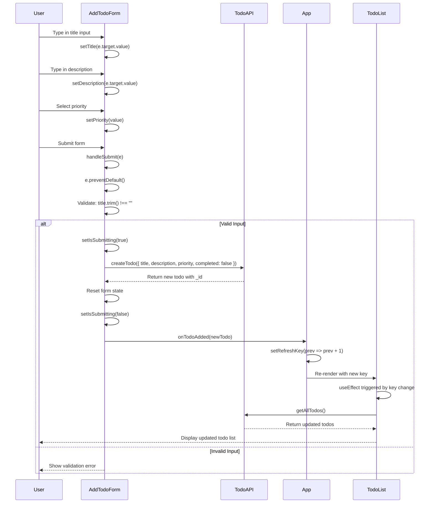

### 3. Edit Todo Flow

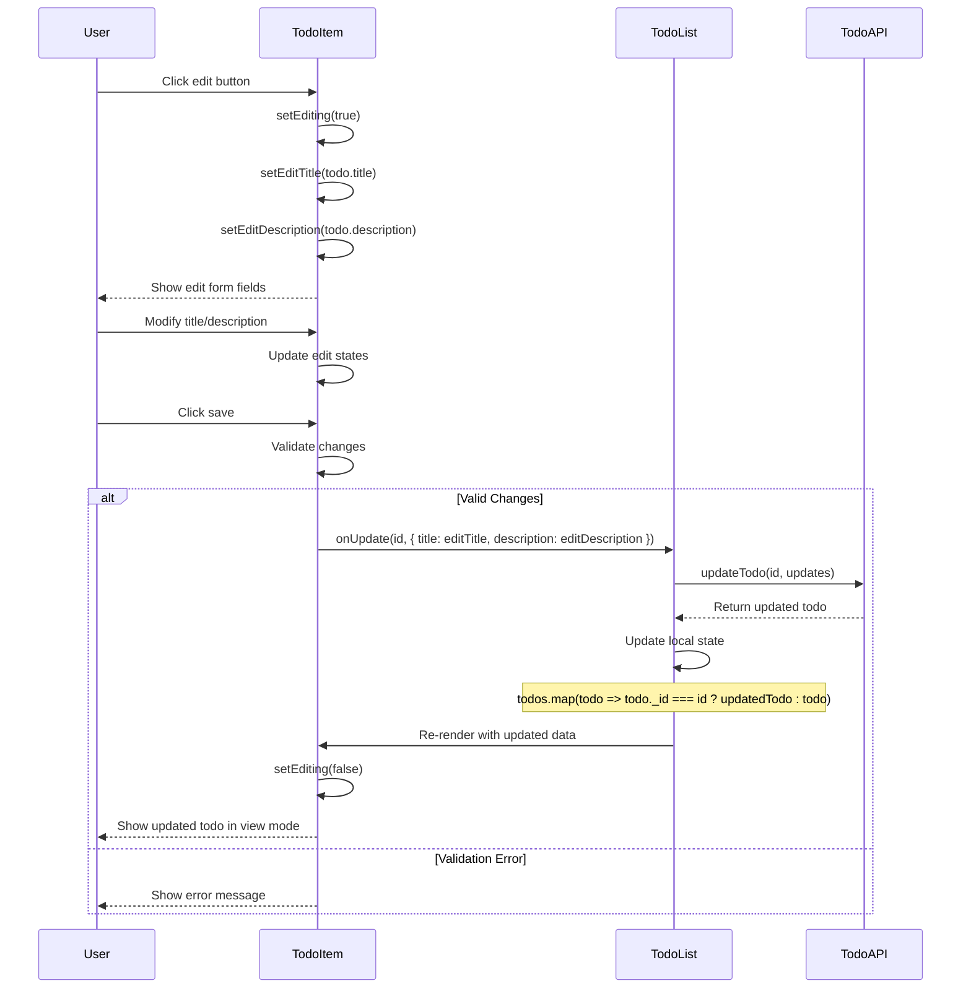

### 4. Toggle Completion Flow

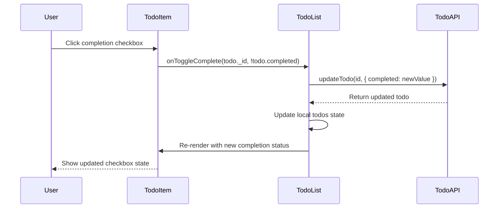

### 5. Delete Todo Flow

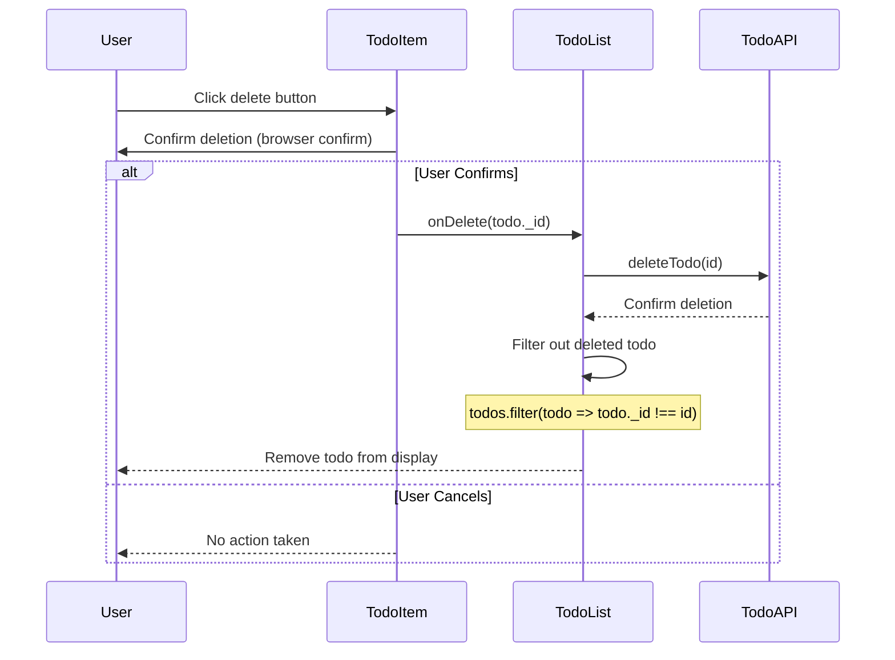

## State Management Patterns

### 6. App-Level State Flow

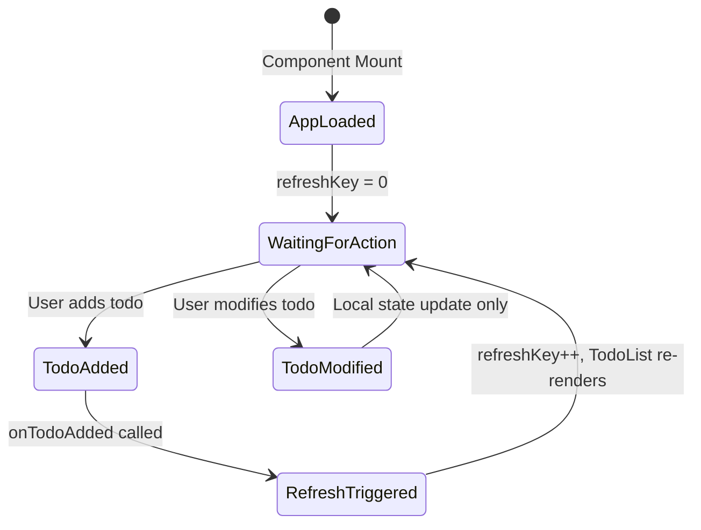

### 7. TodoList State Management

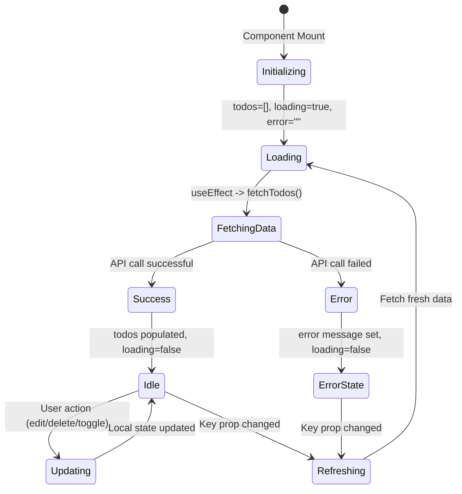

## Error Handling Flow

### 8. Error Propagation Pattern

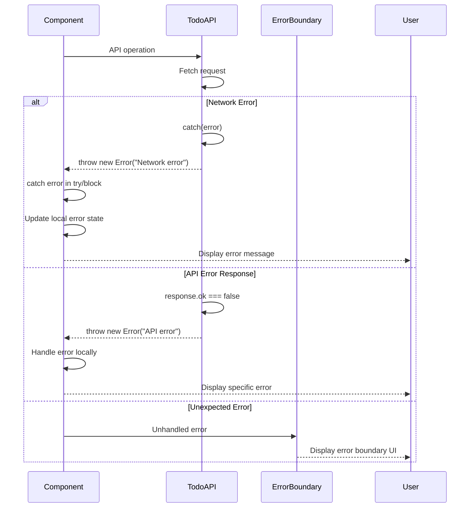

## Performance Optimization Patterns

### 9. Re-rendering Strategy

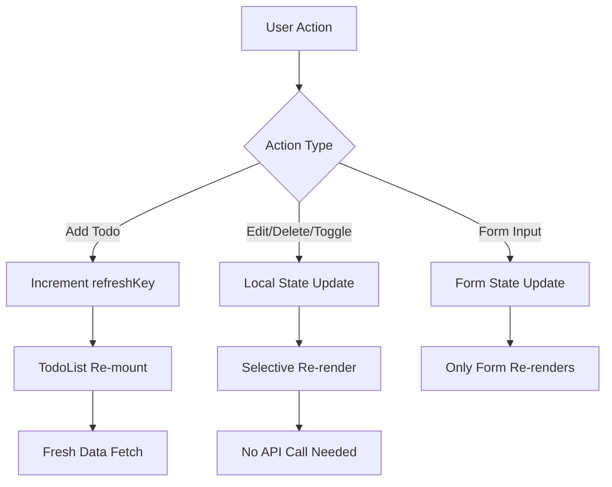

### 10. Component Lifecycle Optimization

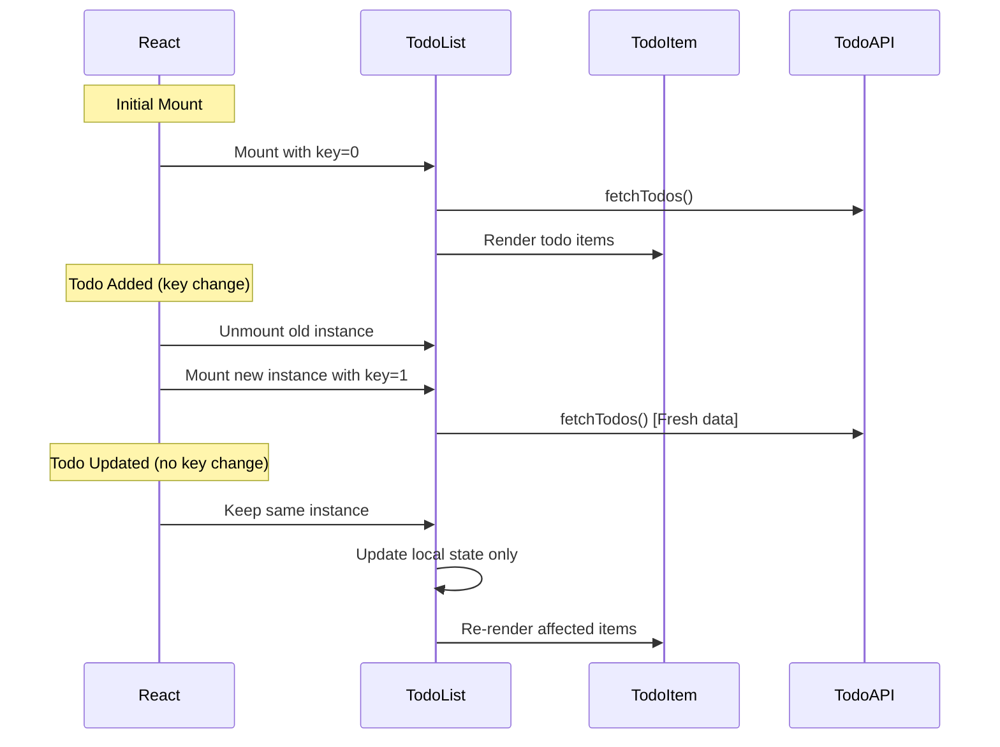

## API Integration Patterns

### 11. Service Layer Pattern

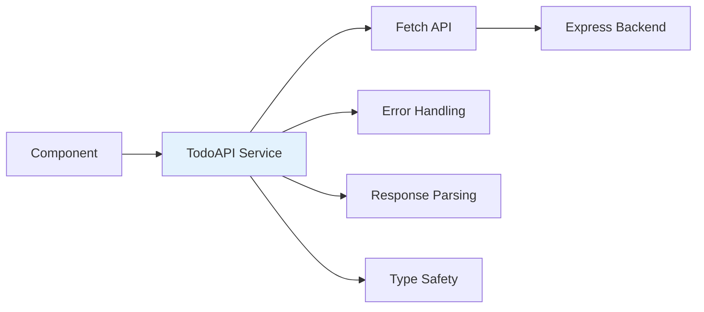

### 12. Data Flow Architecture

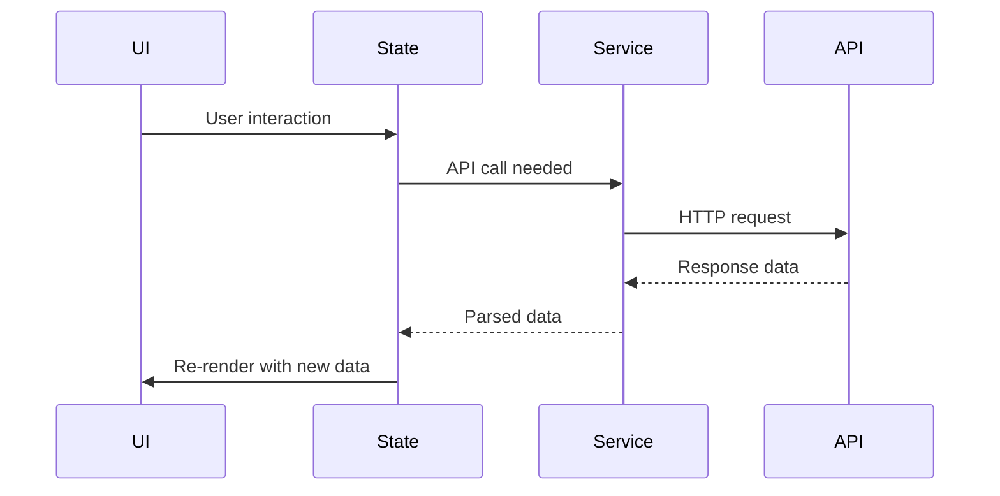

## Form Handling Patterns

### 13. Controlled Component Flow

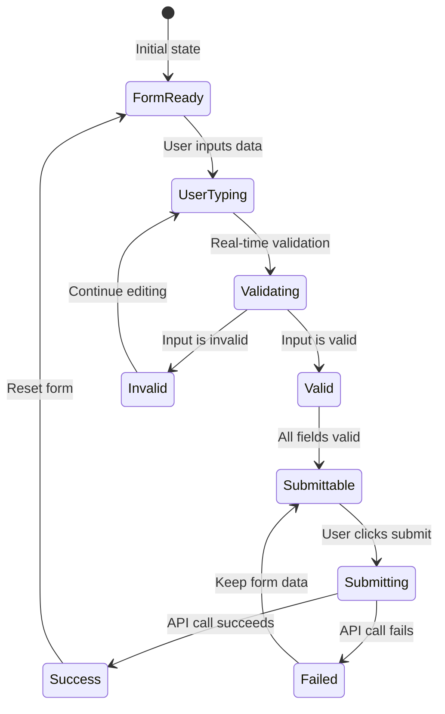

## Key React Patterns Used

### 1. **Custom Hooks Pattern**
- `useState` for local state management
- `useEffect` for side effects and data fetching
- `useCallback` for optimized callback functions

### 2. **Lifting State Up Pattern**
- App component coordinates between AddTodoForm and TodoList
- Callback props for communication between components

### 3. **Service Layer Pattern**
- TodoAPI service encapsulates all HTTP communication
- Consistent error handling across components

### 4. **Controlled Components Pattern**
- Form inputs controlled by component state
- Single source of truth for form data

### 5. **Key Prop Pattern**
- Strategic use of key prop to force TodoList re-mounting
- Efficient way to trigger fresh data fetching

## Performance Considerations

### Optimization Strategies:
1. **Minimal Re-renders**: Local state updates for immediate operations
2. **Strategic Refreshing**: Key prop changes only when new data needed
3. **Error Boundaries**: Graceful error handling without app crashes
4. **Loading States**: Better user experience during async operations
5. **Form Validation**: Client-side validation before API calls

This React.js application flow demonstrates modern React patterns with efficient state management, proper error handling, and optimized performance through strategic re-rendering and data fetching patterns.