# React.js Frontend Architecture Documentation

## Overview
This document provides a comprehensive overview of the React.js frontend architecture for the Todo Application, including detailed sequence diagrams for component interactions, state management, and user flows.

## Architecture Components

### 1. Application Entry Point (`src/index.tsx`)
The main entry point that renders the App component into the DOM.

### 2. App Component (`src/App.tsx`)
The root component that manages the overall application layout and coordinates between child components.

**Key Features:**
- **State Management**: Uses `refreshKey` state to trigger TodoList re-renders
- **Component Coordination**: Manages communication between AddTodoForm and TodoList
- **Layout Structure**: Provides the main application layout with header, main, and footer

### 3. TodoList Component (`src/components/TodoList.tsx`)
Manages the display and operations of the todo list.

**Key Features:**
- **State Management**: Local state for todos, loading, and error states
- **Data Fetching**: Retrieves todos from the API on component mount
- **CRUD Operations**: Handles todo updates and deletions
- **Error Handling**: Displays error messages and loading states

### 4. AddTodoForm Component (`src/components/AddTodoForm.tsx`)
Provides a form interface for creating new todos.

**Key Features:**
- **Form State**: Manages form input states (title, description, priority)
- **Validation**: Client-side validation before submission
- **API Integration**: Calls the API to create new todos
- **Parent Communication**: Notifies parent component when todo is added

### 5. TodoItem Component (`src/components/TodoItem.tsx`)
Individual todo item with inline editing and action capabilities.

**Key Features:**
- **Interactive UI**: Toggle completion, edit in-place, delete actions
- **State Management**: Local editing state for inline updates
- **Event Handling**: Manages user interactions and propagates changes

### 6. API Service Layer (`src/services/todoAPI.ts`)
Centralized API communication layer using the Fetch API.

**Available Methods:**
- `getAllTodos()` - Fetch all todos
- `getTodoById(id)` - Fetch specific todo
- `createTodo(todo)` - Create new todo
- `updateTodo(id, updates)` - Update existing todo
- `deleteTodo(id)` - Delete todo

### 7. Type Definitions (`src/types/Todo.ts`)
TypeScript interfaces for type safety and better development experience.

---

## Component Interaction Sequence Diagrams

### 1. Application Initialization Flow

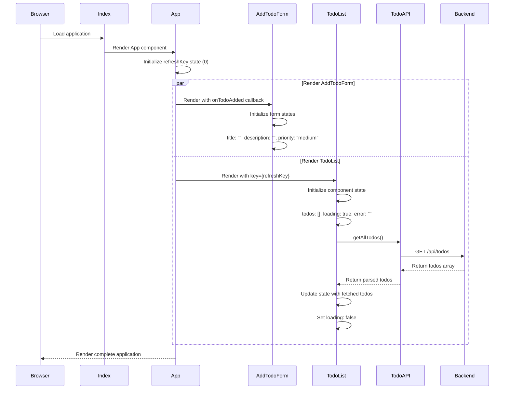

### 2. Create New Todo Flow

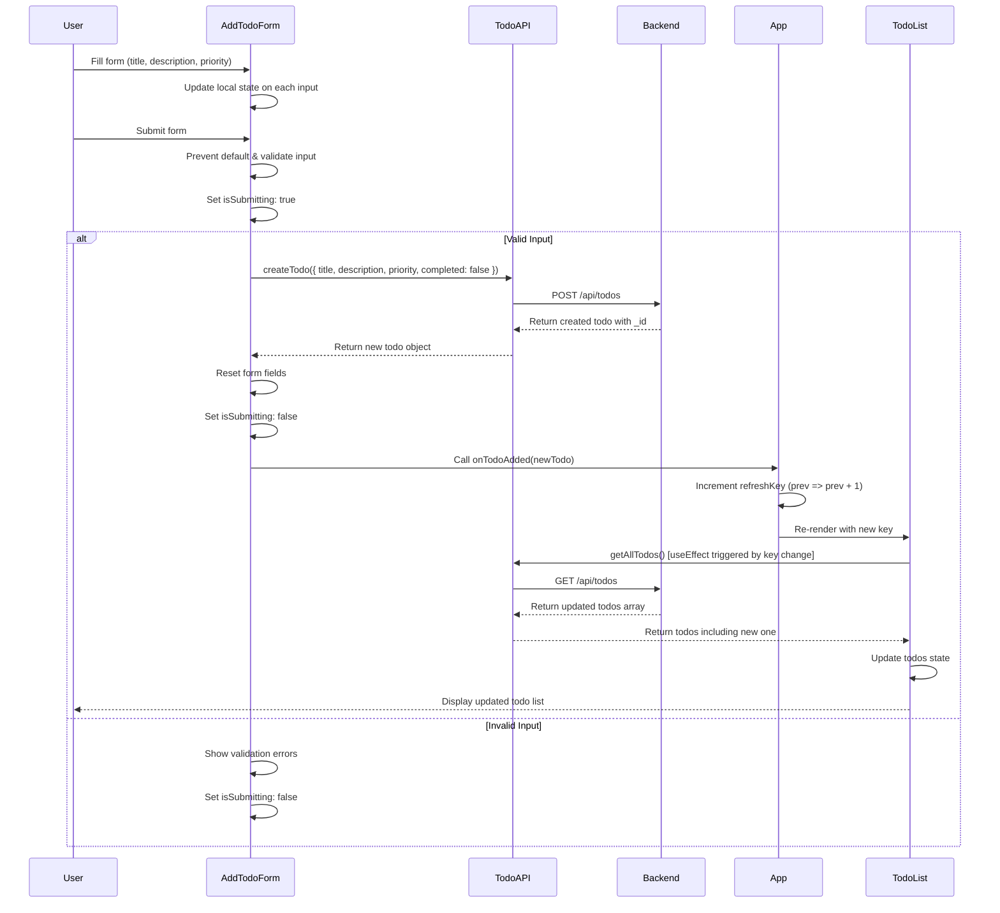

### 3. Toggle Todo Completion Flow

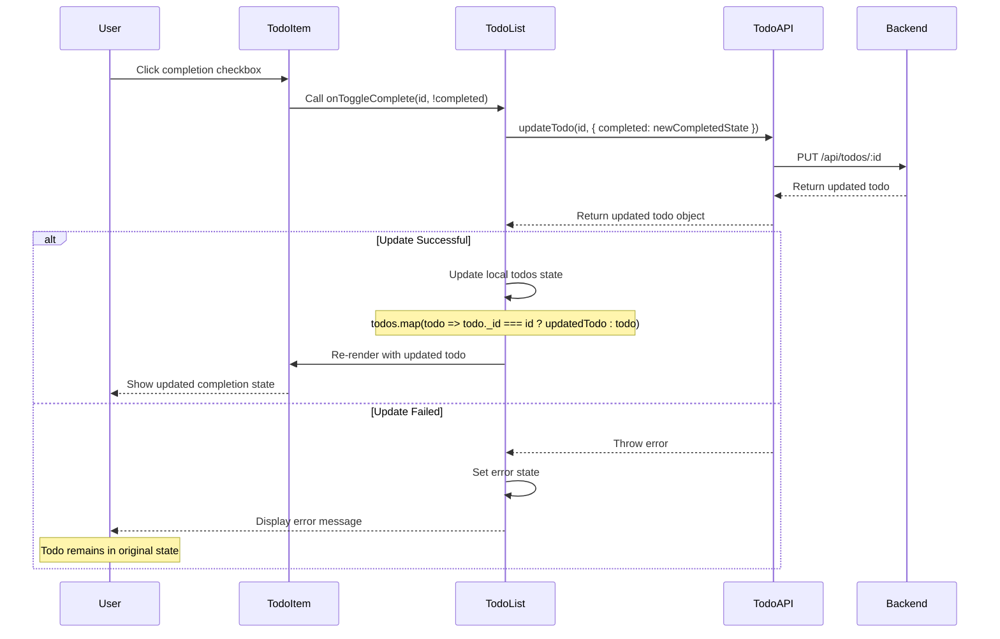

### 4. Edit Todo Flow

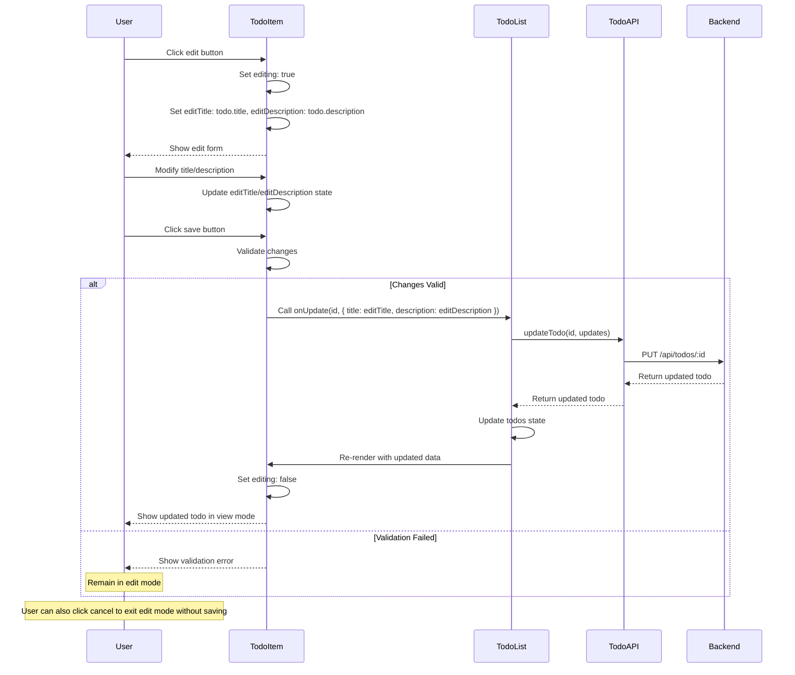

### 5. Delete Todo Flow

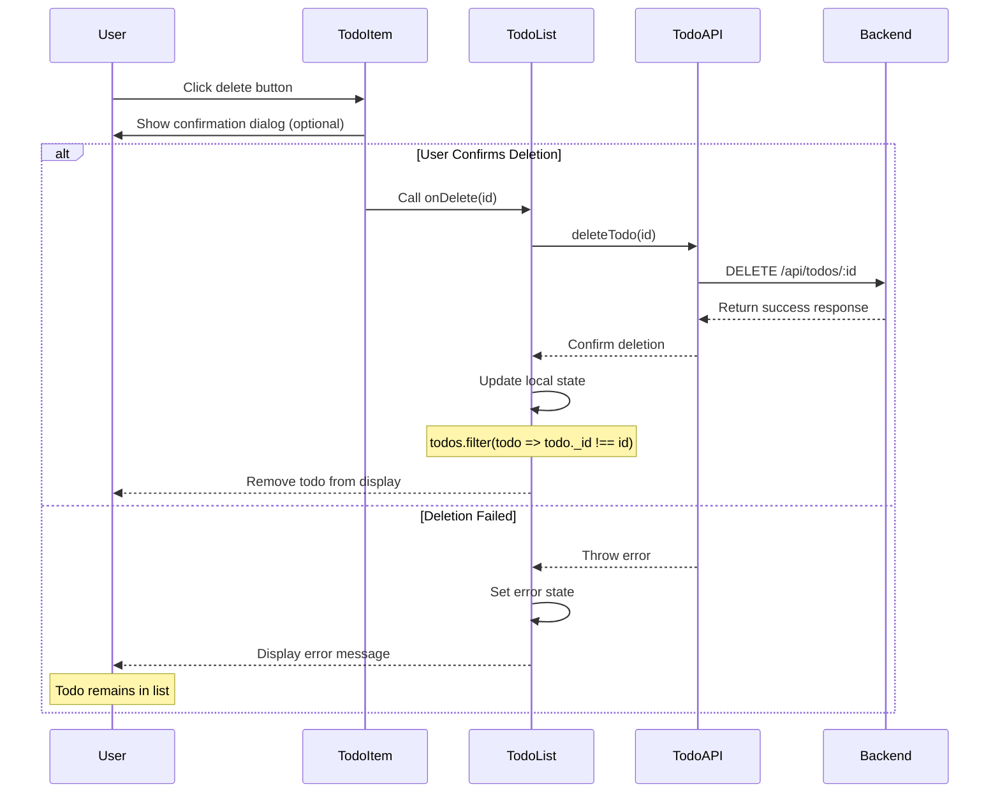

### 6. Error Handling Flow

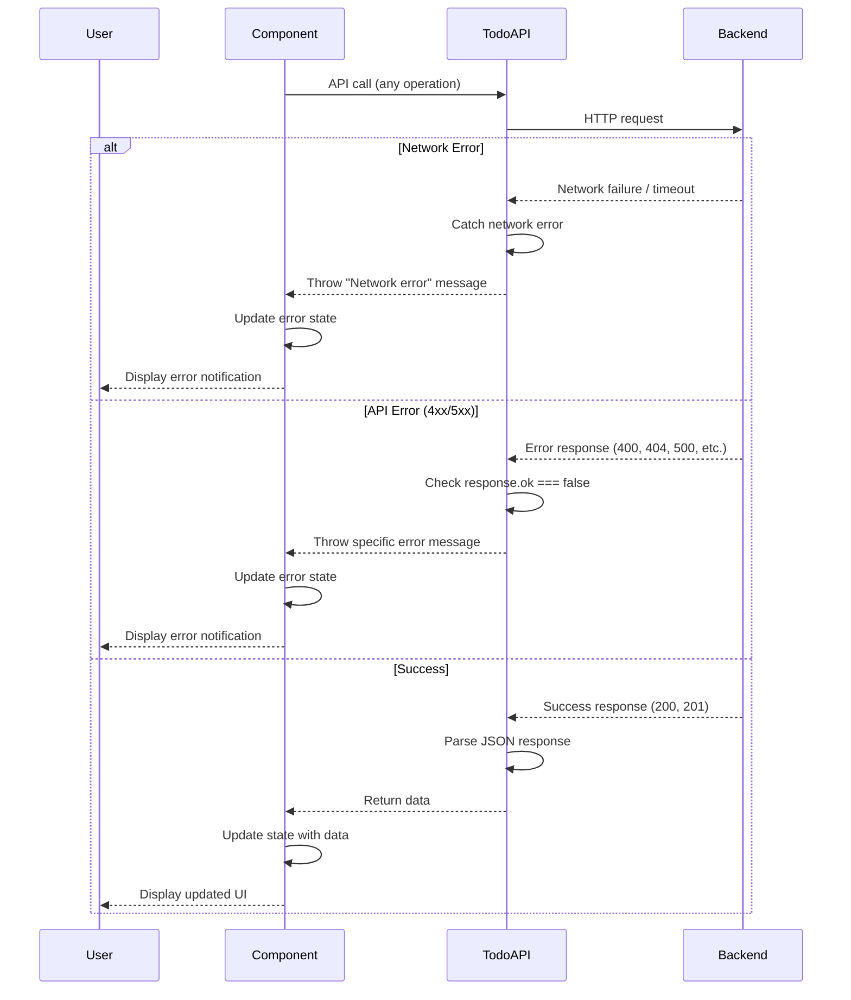

---

## State Management Flow

### 1. App Level State Management

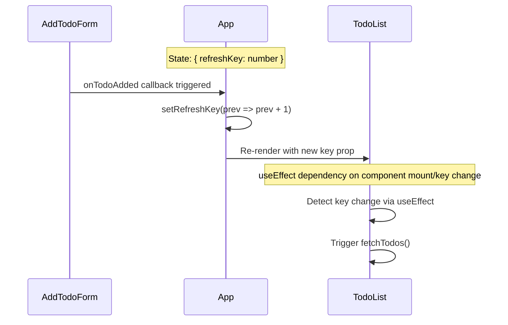

### 2. TodoList State Management

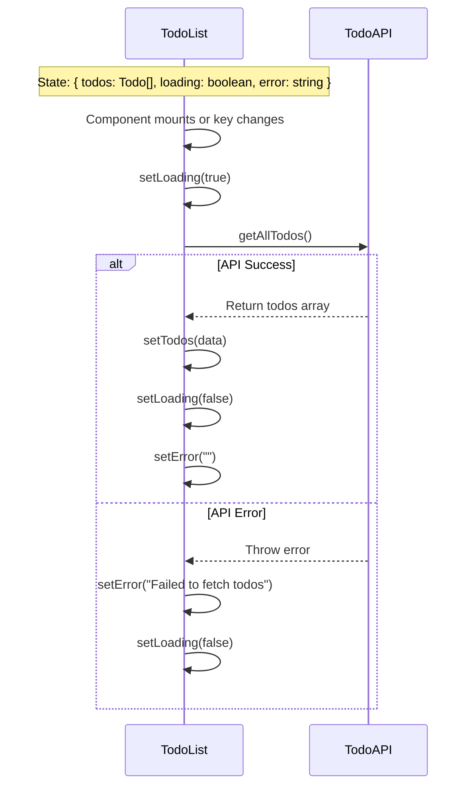

### 3. AddTodoForm State Management

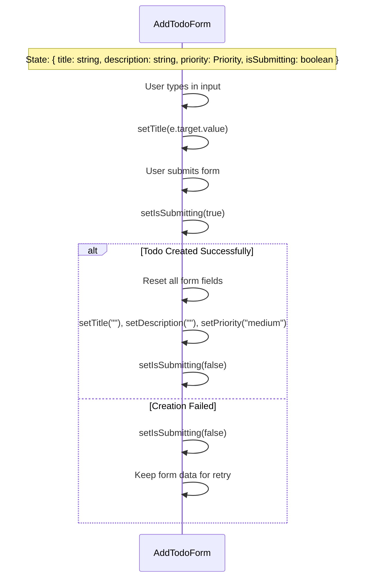

---

## Component Lifecycle and Hooks Usage

### 1. TodoList Component Lifecycle

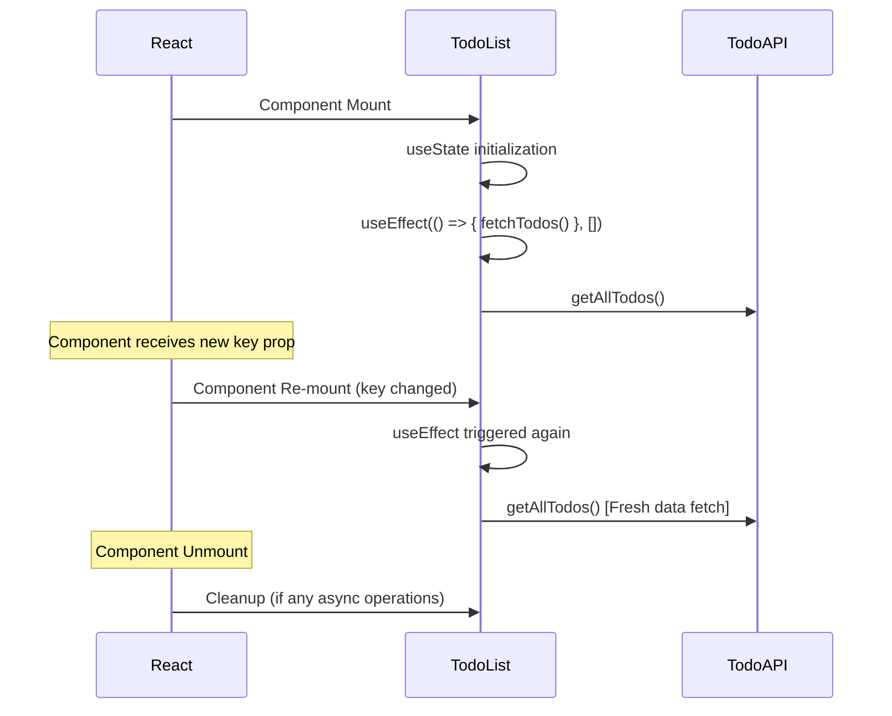

### 2. Form Component Lifecycle

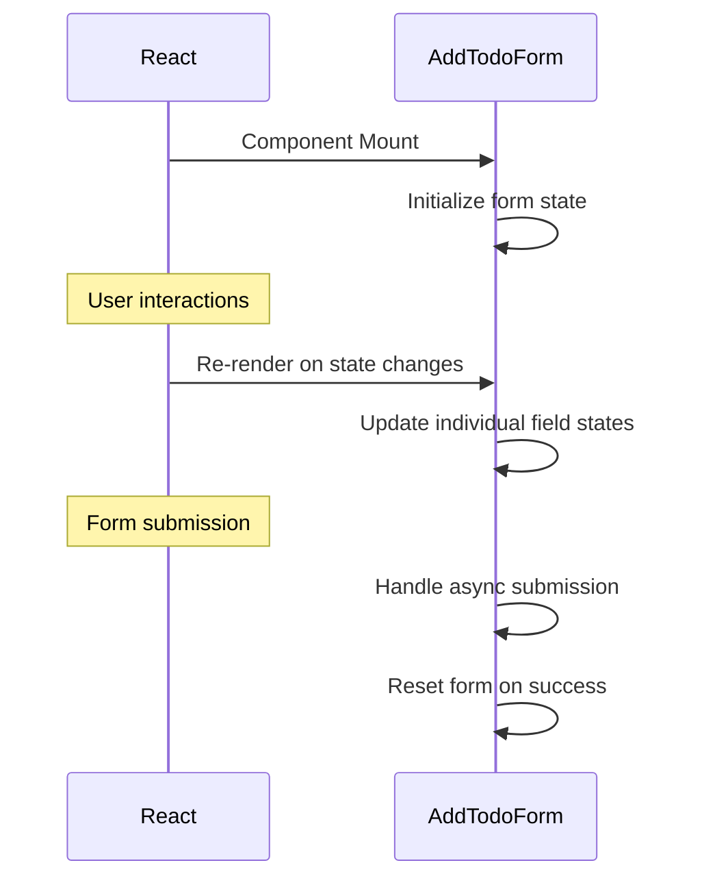

---

## API Integration Patterns

### 1. Service Layer Pattern

The application uses a centralized service layer (`todoAPI.ts`) that:
- Encapsulates all HTTP communication
- Provides consistent error handling
- Handles request/response transformation
- Uses modern Fetch API with proper error checking

### 2. Error Propagation Pattern

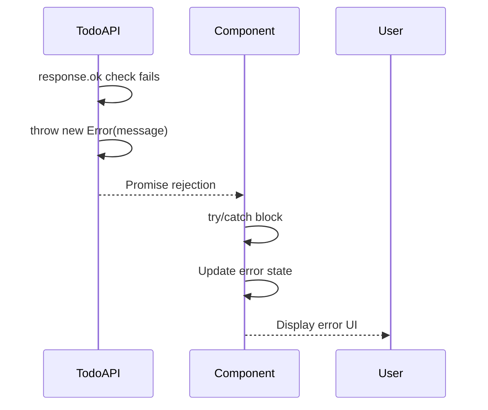

---

## Key Features

### 1. **Type Safety**
- Full TypeScript implementation
- Strongly typed interfaces for Todo objects
- Type-safe API service methods
- Props and state typing for all components

### 2. **State Management**
- Local component state using React hooks
- Minimal prop drilling through callback functions
- Strategic re-rendering using key prop pattern
- Optimistic UI updates where appropriate

### 3. **User Experience**
- Loading states during API operations
- Error handling with user-friendly messages
- Form validation with immediate feedback
- Responsive design for mobile compatibility

### 4. **Performance**
- Efficient re-rendering using React keys
- Minimal API calls with strategic data fetching
- Local state updates for immediate UI feedback
- Component memoization opportunities (can be added)

### 5. **Maintainability**
- Separation of concerns with service layer
- Reusable component architecture
- Consistent error handling patterns
- Clear component responsibilities

### 6. **Accessibility**
- Semantic HTML elements
- Proper form labels and ARIA attributes
- Keyboard navigation support
- Screen reader compatibility

---

## Component Props and State Summary

### App Component
**State:** `{ refreshKey: number }`
**Props:** None
**Callbacks:** `handleTodoAdded`

### TodoList Component
**State:** `{ todos: Todo[], loading: boolean, error: string }`
**Props:** `{ key: number }` (from App)
**Methods:** `fetchTodos`, `handleToggleComplete`, `handleDeleteTodo`, `handleUpdateTodo`

### AddTodoForm Component
**State:** `{ title: string, description: string, priority: Priority, isSubmitting: boolean }`
**Props:** `{ onTodoAdded: (todo: Todo) => void }`
**Methods:** `handleSubmit`

### TodoItem Component
**State:** `{ editing: boolean, editTitle: string, editDescription: string }`
**Props:** `{ todo: Todo, onToggleComplete, onDelete, onUpdate }`
**Methods:** `handleEdit`, `handleSave`, `handleCancel`

This React.js architecture provides a clean, maintainable, and scalable frontend solution with proper component separation, state management, and user experience considerations.